# ⚡ NeuroArena: Gradients of the Wild
### *Next-Gen 3D Machine Learning Action-Adventure, Simulation Engine & Competitive Multiplayer Ecosystem*

[](https://unity.com/)
[](https://unity.com/)
[](https://docs.unity3d.com/Packages/com.unity.burst@latest)
[](https://dotnet.microsoft.com/)
[-yellow.svg)](https://colyseus.io/)
[](https://colyseus.io/)
[](https://en.wikipedia.org/wiki/Glicko_rating_system)
[](https://developer.mozilla.org/en-US/docs/Web/API/Web_Audio_API)
[](https://agones.dev/)

---

## 📖 Table of Contents
1. [🌟 Executive Overview & Concept](#-executive-overview--concept)
2. [🏗️ System Architecture](#️-system-architecture)
3. [🧠 Core Machine Learning & Simulation Engines](#-core-machine-learning--simulation-engines)
   - [Dataset Health Score & Honest Generalization](#dataset-health-score--honest-generalization)
   - [Stage 29 Model Consult & Extrapolation Visualizer](#stage-29-model-consult--extrapolation-visualizer)
   - [Dataset Shift Sandbox (Concept Drift & Covariate Shift)](#dataset-shift-sandbox-concept-drift--covariate-shift)
   - [Real-Time Mathematical Training Narration & Adaptive Coaching Layer](#real-time-mathematical-training-narration--adaptive-coaching-layer)
   - [Neuroevolution & Genetic Hyperparameter Optimization](#neuroevolution--genetic-hyperparameter-optimization)
   - [Reinforcement Learning PPO Policy Agents](#reinforcement-learning-ppo-policy-agents)
   - [WebAssembly (WASM) Model Runtime & Web Workers](#webassembly-wasm-model-runtime--web-workers)
4. [🗺️ The 6-Biome Mathematical Curriculum](#️-the-6-biome-mathematical-curriculum)
5. [⚔️ Competitive Multiplayer, Netcode & Esports](#️-competitive-multiplayer-netcode--esports)
   - [Colyseus Authoritative Server & Zero-Copy Binary Protocol](#colyseus-authoritative-server--zero-copy-binary-protocol)
   - [1v1 Live Duels & Hidden Test Set Evaluation](#1v1-live-duels--hidden-test-set-evaluation)
   - [2-4 Player Collaborative Co-op Rooms (CoopRoom) & ML Dataset Health](#2-4-player-collaborative-co-op-rooms-cooproom--ml-dataset-health)
   - [6-Biome Procedural Variant & Mathematical Solvability Engine](#6-biome-procedural-variant--mathematical-solvability-engine)
   - [Seasonal Ranked League, Glicko-2 Tier Progression & Cross-Platform Parity](#seasonal-ranked-league-glicko-2-tier-progression--cross-platform-parity)
   - [Skill-Based Matchmaking (Glicko-2 Engine)](#skill-based-matchmaking-glicko-2-engine)
   - [Clans & Factions: Guild Warfare & Shared Skill Trees](#clans--factions-guild-warfare--shared-skill-trees)
   - [Deterministic Tick Replay & Spectator Verification](#deterministic-tick-replay--spectator-verification)
   - [Telemetry Anomaly Detection & Anti-Cheat Pipeline](#telemetry-anomaly-detection--anti-cheat-pipeline)
6. [🎨 Graphics, Audio & Cross-Platform UX](#-graphics-audio--cross-platform-ux)
   - [Dynamic WebGPU & WebGL Post-Processing Pipeline](#dynamic-webgpu--webgl-post-processing-pipeline)
   - [GPU Compute Particle Engine (Harvest, Boss, Ambience)](#gpu-compute-particle-engine-harvest-boss-ambience)
   - [Systematic "Juice" Feedback & Presentation Layer](#systematic-juice-feedback--presentation-layer)
   - [Playable First-Session FTUE Tutorial](#playable-first-session-ftue-tutorial)
   - [Spatial 3D Audio DSP & Adaptive Soundtrack](#spatial-3d-audio-dsp--adaptive-soundtrack)
   - [Gamepad, Keyboard Remapping & Haptic Feedback](#gamepad-keyboard-remapping--haptic-feedback)
   - [Android Gyroscope & Motion-Orientation Camera](#android-gyroscope--motion-orientation-camera)
   - [Multi-Language Internationalization (i18n)](#multi-language-internationalization-i18n)
   - [Multi-Tier Mobile Profiler (2GB RAM Low-End Safeguards)](#multi-tier-mobile-profiler-2gb-ram-low-end-safeguards)
7. [💾 Cloud Infrastructure, Storage & Security](#-cloud-infrastructure-storage--security)
   - [Supabase Auth & Distributed Redis Leaderboards](#supabase-auth--distributed-redis-leaderboards)
   - [Delta-Compressed Cloud Saves & Cryptographic Integrity](#delta-compressed-cloud-saves--cryptographic-integrity)
   - [Hardened Save Migration Engine (Schema v3)](#hardened-save-migration-engine-schema-v3)
   - [Privacy-Conscious Event Analytics Pipeline](#privacy-conscious-event-analytics-pipeline)
   - [Live-Ops Remote Configuration & Dynamic Balance Tuning](#live-ops-remote-configuration--dynamic-balance-tuning)
8. [🛠️ Developer CLI & Testing Harness](#️-developer-cli--testing-harness)
9. [🚀 Getting Started & Deployment Guide](#-getting-started--deployment-guide)
10. [📁 Repository Structure](#-repository-structure)

---

## 🌟 Executive Overview & Concept

**NeuroArena: Gradients of the Wild** is a 3D machine learning action-adventure game, scientific simulation platform, and competitive multiplayer arena. Players step into the role of an **Architect**, navigating procedurally generated low-poly mathematical biomes, harvesting empirical data tokens, observing live 3D gradient descent surfaces, fine-tuning neural hyperparameters, and unleashing custom-trained AI models in real-time boss battles and live 1v1 multiplayer duels.

### Key Highlights
- **Zero Black-Box ML Libraries:** Every algorithm (Linear/Logistic Regression, Regularized Polynomials, Decision Trees, 2-Layer Neural Networks, PPMI Word Embeddings, Genetic Neuroevolution, and PPO Reinforcement Learning) is implemented **from scratch** in pure C# (Unity Burst/Jobs) and modern JavaScript/WebAssembly.
- **Dual-Engine Architecture:** High-fidelity Unity 2022.3 LTS+ native mobile client alongside a zero-install Three.js Web PWA client featuring complete visual, gameplay, and mathematical parity.
- **Authoritative Multiplayer & Esports:** Colyseus-powered real-time rooms, zero-copy binary tick serialization (28 bytes/tick), Glicko-2 rating system with volatility tracking, and server-side hidden test set validation.
- **Scientifically Grounded:** Honest mathematical feedback with zero fake multipliers—data quality, concept drift, overfitting, and extrapolation errors have real computational consequences.

---

## 🏗️ System Architecture

```mermaid
flowchart TD
    subgraph ClientLayer ["Client Layer (Dual Platform Parity)"]
        UnityClient["Unity 2022.3 LTS Client\n(C# / Burst / Jobs / URP 14+)"]
        WebClient["Web PWA Client (Three.js)\n(WebGPU + WebGL Fallback / WASM / Workers)"]
        ComputeParticles["GPU Compute Particles\n(Compute Shaders / Float32Array CPU Fallback)"]
        AudioDSP["Spatial 3D Audio DSP\n(Web Audio API / Procedural Synth)"]
        InputEngine["Input Manager\n(Gamepad / Gyro / Keyboard Remap)"]
    end

    subgraph NetworkLayer ["Real-Time Multiplayer & Netcode"]
        ColyseusCore["Colyseus Game Server\n(Node.js / TypeScript)"]
        ArenaRoom["ArenaRoom (Exploration & Relays)"]
        DuelRoom["DuelRoom (90s 1v1 Synchronized Duels)"]
        CoopRoom["CoopRoom (2-4 Player Collaborative ML Rooms)"]
        FastProto["Fast Binary Protocol\n(28-byte Zero-Copy Packed Ticks)"]
        ReplayEngine["Deterministic Tick Replay &\nState Reconciliation Engine"]
    end

    subgraph BackendServices ["Backend Services & Microservices"]
        Glicko2["Glicko-2 SBMM Engine\n(Volatility & Queue Expansion)"]
        SeasonalRanked["Seasonal Ranked League\n(5 Tiers & Soft MMR Resets)"]
        AdaptiveCoaching["Adaptive Coaching & Difficulty\n(Bounded Envelopes & Audit Logs)"]
        GuildSystem["Guilds & Factions Service\n(Skill Trees & Seasonal Trophies)"]
        CheatEngine["Telemetry & Anomaly Detector\n(Anti-Speedhack & Weight Replay)"]
        TournamentEngine["Swiss Tournament Bracket Engine"]
        LeaderboardService["Distributed Redis Leaderboards\n(Sorted Sets / Seasonal Elo Decay)"]
    end

    subgraph DataStorage ["Persistence & Cloud Infrastructure"]
        Supabase["Supabase Auth & PostgreSQL"]
        CloudSave["Cloud Save Snapshot Engine\n(LZ Delta Compression & HMAC-SHA256)"]
        RemoteConfig["Live-Ops Remote Config\n(Schema v3 Safe Balance Tuning)"]
        AgonesK8s["Agones Game Server Fleet\n(Terraform AWS/GCP Multi-Region K8s)"]
        PromMetrics["Prometheus & OpenTelemetry Exporter"]
    end

    UnityClient <-->|WebSocket / Binary| ColyseusCore
    WebClient <-->|WebSocket / Binary| ColyseusCore
    ColyseusCore --> ArenaRoom & DuelRoom & CoopRoom
    ArenaRoom & DuelRoom & CoopRoom --> FastProto & ReplayEngine
    ColyseusCore --> Glicko2 & SeasonalRanked & AdaptiveCoaching & GuildSystem & CheatEngine & TournamentEngine
    ColyseusCore --> LeaderboardService
    ColyseusCore --> Supabase & CloudSave & RemoteConfig
    ColyseusCore --> PromMetrics
    AgonesK8s -.-> ColyseusCore
```



---

## 🧠 Core Machine Learning & Simulation Engines

### Dataset Health Score & Honest Generalization
Training performance on unseen test sets is governed strictly by empirical data geometry:
$$\text{Health Score} = 0.35 \cdot S_{\text{balance}} + 0.35 \cdot S_{\text{cleanliness}} + 0.30 \cdot S_{\text{coverage}}$$
- **Balance ($S_{\text{balance}}$):** Class proportion or residual symmetry: $1.0 - |\text{ratio}_0 - \text{ratio}_1|$.
- **Cleanliness ($S_{\text{cleanliness}}$):** Penalty for extreme outliers: $1.0 - 3.5 \cdot (\text{Outliers} / N)$.
- **Coverage ($S_{\text{coverage}}$):** Domain span $[\min(X), \max(X)]$ and harvest density.
- **Pre-Training Forecast:** The Formula Terminal provides predictive diagnostics (*"High Generalization Expected (>90%)"* vs *"Severe Generalization Failure Predicted (<65%)"*). Corrupted datasets naturally skew parameter vectors $(w, b)$, creating real generalization failure on held-out test distributions.

### Stage 29 Model Consult & Extrapolation Visualizer
- **Analytical Inference:** Arbitrary user queries execute live mathematical inference ($\hat{y} = wx+b$, $\sigma(w^Tx+b)$, etc.).
- **Euclidean Domain Check:** Measures minimum distance to harvested training samples:
  $$d_{\min} = \min_{i} \| X_{\text{query}} - X_{\text{train}, i} \|$$
- **Glitch Chromatic Framing:** Out-of-distribution queries trigger an **Extrapolation Warning**, displaying how unbounded continuous decision boundaries make blind predictions across uncharted coordinate space.

### Dataset Shift Sandbox (Concept Drift & Covariate Shift)
- **Interactive Distribution Blending:** Mix samples from conflicting biomes (e.g., *Linear Steppes* $y = 2.45x + 1.15$ vs *Shifted Tundra* $y = -1.80x + 6.20$) using a live slider ($5\% - 95\%$).
- **Demonstration of Model Failure:** The optimizer struggles on conflicting multi-modal gradients, showing elevated MSE ($J \approx 3.42$).
- **Live Visual Diagnosis:** Dual-color scatter points clearly illustrate **Covariate Shift** ($P_{\text{train}}(X) \neq P_{\text{test}}(X)$) and **Concept Drift** ($P_{\text{train}}(Y|X) \neq P_{\text{test}}(Y|X)$).

### Real-Time Mathematical Training Narration & Adaptive Coaching Layer
A dynamic commentary system converts live training telemetry into plain-English mathematical explanations without canned flavor text, extending seamlessly into an opt-in coaching and bounded adaptive-difficulty layer for practice sessions:
- **Slope Rotation:** *"The decision line is rotating rapidly ($\Delta w = +0.75$) to reduce initial residual errors."*
- **Overfitting Alert:** *"Overfitting detected: training error is low ($J_{\text{train}} = 0.040$) but validation error rose ($J_{\text{val}} = 1.850$, gap $= +1.81$). Model is memorizing noise."*
- **Gradient Oscillation:** *"Gradient reversed sign ($\nabla w = -0.75 \to +0.85$): optimizer is bouncing across steep coordinate canyon walls."*
- **Bounded Adaptive Difficulty:** Tracks telemetry struggle signals (3x consecutive boss failures, repeated overfitting alerts) to apply strictly bounded difficulty envelopes (noise scale $\ge 0.75$, outlier rate $\ge 0.70$, boss HP $\ge 0.85$). Solvability certificates are verified and auto-wins are forbidden.
- **Opt-In Coaching Escalation:** After $\ge 2$ boss failures, the system offers diagnostic concept guidance (e.g. suggesting $L_2$ regularization / weight decay) strictly upon player opt-in with zero spoilers of solution weights or answers.
- **Player Transparency Audit Log:** Every difficulty adjustment produces an inspectable log ("Why was this run easier?") explaining the exact telemetry reasons and modifier values applied.
- **Server-Side Ranked Guard:** Adaptive assistance and hints are strictly forbidden and rejected via server-side room-type guards in `DuelRoom` and ranked matches.

### Neuroevolution & Genetic Hyperparameter Optimization
- **Population-Based Search:** Population of $N=20$ candidate parameter sets evolved over successive generations.
- **Genetic Operators:** Elitism preservation, tournament selection ($k=3$), uniform parameter crossover, and adaptive Gaussian mutation ($\mu=0, \sigma=0.05$).
- **Fitness Evaluation:** Multi-objective scoring combining validation accuracy, convergence speed, and model sparsity.

### Reinforcement Learning PPO Policy Agents
- **Actor-Critic Architecture:** Autonomous bot agents powered by Proximal Policy Optimization (PPO) with clipped surrogate objective:
  $$L^{\text{CLIP}}(\theta) = \hat{\mathbb{E}}_t \left[ \min\left(r_t(\theta)\hat{A}_t, \text{clip}(r_t(\theta), 1-\epsilon, 1+\epsilon)\hat{A}_t\right) \right]$$
- **Curiosity-Driven Exploration:** Intrinsic reward bonus based on forward-dynamics prediction error in state-action feature space.

### WebAssembly (WASM) Model Runtime & Web Workers
- **WASM Acceleration:** High-throughput matrix multiplications and forward passes compiled for WebAssembly runtime execution.
- **Background Thread Offloading:** Web Worker threads process training epochs and cross-validation asynchronously, preventing UI lockups and frame drops on the main render thread.

---

## 🗺️ The 6-Biome Mathematical Curriculum

| Biome | Mathematical ML Concept | Target Loss / Objective | Weapons & Tools Arsenal | Boss Entity |
| :--- | :--- | :--- | :--- | :--- |
| **1. Linear Steppes** | 1D Continuous Linear Regression | $\min_{w, b} \frac{1}{2N}\sum(wx+b - y)^2$ | SGD, Momentum, RMSprop, Adam | *The Outlier Titan* |
| **2. Binary Marshlands** | Logistic Regression & Sigmoid Classification | $\min_w -\frac{1}{N}\sum [y\log\hat{y} + (1-y)\log(1-\hat{y})]$ | Cross-Entropy Staff, Sigmoid Membranes | *The Hyperplane Hydra* |
| **3. Variance Tundra** | Polynomials & Regularization ($L_1 / L_2$) | $\min_w \text{MSE} + \lambda_2\|w\|_2^2 + \lambda_1\|w\|_1$ | Poly Catalyst, Ridge ($L_2$), Lasso ($L_1$) | *The Overfit Colossus* |
| **4. Branching Canopy** | Decision Trees & Bagging Ensembles | $\text{Gini} = 1 - \sum p_i^2$, $\text{Entropy} = -\sum p_i\log_2 p_i$ | Bagging Party (5 Bootstrapped Trees) | *The Dendrogram Dragon* |
| **5. Deep Synapse Citadel** | 2-Layer Neural Networks & XOR Manifolds | $\hat{y} = \sigma(W_2 \cdot \text{ReLU}(W_1 x + b_1) + b_2)$ | Backpropagation Wand, Hidden Layer Dials | *The Non-Linear Overlord* |
| **6. Semantic Expanse** | Word Embeddings & Cosine Similarity | $\text{sim}(u, v) = \frac{u \cdot v}{\|u\|_2 \|v\|_2}$ | PPMI Matrix, Top-K Vector Retrieval | *The High-Dimensional Void* |

---

## ⚔️ Competitive Multiplayer, Netcode & Esports

### Colyseus Authoritative Server & Zero-Copy Binary Protocol
- **High-Frequency Ticks:** Synchronized 20Hz server tick loop with client-side interpolation and prediction.
- **Ultra-Compact Binary Protocol:** Packed 28-byte binary layout for transform packets containing:
  - Header & Client ID (4 bytes)
  - Sequence ID & Tick (4 bytes)
  - Quantized Positions $[X, Y, Z]$ (6 bytes)
  - Quantized Rotation $[Pitch, Yaw]$ (4 bytes)
  - Input & Activity Bitmasks (2 bytes)
  - Energy & Health (4 bytes)
  - CRC-16 Checksum (2 bytes)

### 1v1 Live Duels & Hidden Test Set Evaluation
- **Synchronized Matchmaking:** 90-second private arena duels where both players harvest live tokens and fit models independently.
- **Authoritative Verification:** At match conclusion, submitted weight matrices $(w, b)$ are scored simultaneously on the server against a **secret held-out test distribution of 50 samples** unknown to both clients.
- **Zero-Trust Scoring:** Prevents client memory inspection or hardcoded target models.

### 2-4 Player Collaborative Co-op Rooms (`CoopRoom`) & ML Dataset Health
- **Genuine ML Collaboration:** Party members are assigned complementary domain partitions (e.g. Sector Alpha $x \in [-6.5, -3.25]$ through Sector Delta $x \in [3.25, 6.5]$).
- **Multi-Partition Domain Coverage ($C_{\text{cov}}$):**
  $$C_{\text{cov}} = \left( 0.50 \cdot \frac{K_{\text{sampled}}}{K_{\text{total}}} + 0.35 \cdot \frac{\text{Span}_{\text{actual}}}{\text{Span}_{\text{target}}} + 0.15 \cdot \min\left(1.0, \frac{N_{\text{total}}}{8 \cdot N_{\text{party}}}\right) \right) \times 100$$
- **Extrapolation Penalty & Blind Spot Mitigation:** Uncoordinated single-player harvesting leaves uncovered partitions, triggering severe extrapolation error on the server's hidden test set:
  $$\text{MSE}_{\text{effective}} = \text{MSE}_{\text{raw}} \times \left(1 + \max(0, 70 - C_{\text{cov}}) \times 0.05\right)$$
  Combining datasets eliminates blind spots, moving shared health from critical ($<40\%$) to excellent ($>90\%$) and unlocking 100% boss damage capacity.
- **Sub-Linear Party Difficulty Envelope Scaling ($N \in [2, 4]$):**
  $$\text{HP}_{\text{scaled}}(N) = \text{HP}_{\text{base}} \times \left(1.0 + 0.65(N - 1)^{0.85}\right)$$

| Party Size | Domain Span | Domain Partitions | Noise Multiplier | Outlier Multiplier | Boss HP Multiplier | Enrage Timer |
| :--- | :--- | :--- | :--- | :--- | :--- | :--- |
| **1 Player (Solo)** | $[-4.0, 4.0]$ ($8.0$) | 1 Sector | $1.00\times$ | $1.00\times$ | $1.00\times$ ($1000$ HP) | $120\text{s}$ |
| **2 Players** | $[-4.5, 4.5]$ ($9.0$) | 2 Sectors | $1.10\times$ | $1.15\times$ | $1.65\times$ ($1650$ HP) | $100\text{s}$ |
| **3 Players** | $[-5.5, 5.5]$ ($11.0$) | 3 Sectors | $1.20\times$ | $1.25\times$ | $2.25\times$ ($2250$ HP) | $90\text{s}$ |
| **4 Players** | $[-6.5, 6.5]$ ($13.0$) | 4 Sectors | $1.30\times$ | $1.35\times$ | $2.80\times$ ($2800$ HP) | $85\text{s}$ |

- **Tactical Non-Verbal Ping System:** Real-time spatial and domain coordination via structured events paired with dual-motor tactile haptic vibration profiles:
  - `HARVEST_HERE` $\to$ `LightTick` haptic pulse ($35\text{ms}$).
  - `COVERAGE_GAP` $\to$ `MediumImpact` triple pulse ($40\text{ms}, 30\text{ms}, 40\text{ms}$).
  - `OUTLIER_ALERT` $\to$ `MediumImpact` pulse.
  - `BOSS_HAZARD` $\to$ `HeavyRumble` dual-motor pulse ($100\text{ms}, 50\text{ms}, 100\text{ms}$).
  - `ASSEMBLE_TRAIN` $\to$ `SuccessBurst` fanfare pulse ($50\text{ms}, 40\text{ms}, 80\text{ms}$).
- **Server-Authoritative Equal Reward Ledger:** Server calculates total pool from shared dataset health + hidden test accuracy + boss defeat and deposits equal shares with an immutable ledger ID (`SERVER_AUTHORITATIVE_EQUAL_SPLIT`), eliminating ninja-looting while flagging cheaters with 0 reward.
- **15s Reconnection Grace Window:** Mid-session disconnects allow 15 seconds for reconnection with authoritative state resync.

### 6-Biome Procedural Variant & Mathematical Solvability Engine
- **Seeded Procedural Diversity:** No two runs of a biome present identical slope/intercept bounds, classification boundary shapes, polynomial degrees, or noise envelopes.
- **Closed-Form Solvability Prover:** Analytically validates each candidate dataset (e.g. OLS fit $\text{MSE}_{\text{clean}} \le 0.05$) to guarantee target loss is reachable before presenting it to the player. Unsolvable seeds are automatically reseeded.
- **Boss Move-Set Variations:** 3 distinct attack patterns and modulated stat profiles per boss selected deterministically by seed.
- **Poisson-Disc Terrain Scatter Layout:** Modulates terrain density, minimum scatter distance ($4.8\text{--}6.2\text{m}$), and landmark orientation while preserving player/lab spawn exclusion zones.
- **Daily Seed Mode:** Synchronizes all players globally to `DAILY-YYYYMMDD` challenges.

### Seasonal Ranked League, Glicko-2 Tier Progression & Cross-Platform Parity
- **5 Competitive Tiers:** Bronze ($0\text{--}999$) ➔ Silver ($1000\text{--}1399$) ➔ Gold ($1400\text{--}1799$) ➔ Platinum ($1800\text{--}2199$) ➔ Architect ($2200+$).
- **Visible Rank-Up Juice Moment:** Emits high-impact hit-stop (65ms), camera shake (0.50), 150 GPU particles, dual-motor haptics, and fanfare audio.
- **6-Week Season Cadence & Soft MMR Reset:** Regresses player rating toward mean at season rollover without hard wipes:
  $$\text{Rating}_{\text{new}} = \max\left(800, 1500 + (\text{Rating}_{\text{old}} - 1500) \times 0.65\right)$$
- **End-of-Season Reward Disbursement:** Automatically grants exclusive cosmetics, titles, and quantum shards to player accounts.
- **Historical Season Top 100 Archival:** Permanent immutable snapshots queryable via `GET /api/ranked/seasons/:seasonId/leaderboard`.
- **100% Cross-Progression Parity:** Unity Android and Web PWA clients access the identical account state, MMR, guild status, and inventory.

### Skill-Based Matchmaking (Glicko-2 Engine)
- **Mathematical Rating System:** Full Glicko-2 implementation tracking Player Rating ($\mu$), Rating Deviation ($\phi$), and Rating Volatility ($\sigma$).
- **Dynamic Search Radius:** Matchmaking pool expands progressively:
  $$r(t) = r_{\text{initial}} + \delta_{\text{expand}} \cdot \ln(1 + t)$$

### Clans & Factions: Guild Warfare & Shared Skill Trees
- **Guild Progression:** Persistent guilds with custom crests, rosters, and seasonal guild trophy leaderboards.
- **Shared Skill Trees:** Guild members contribute harvested XP to unlock global perks:
  - `BASE_EXP_BOOST` (+15% harvest yield)
  - `BURST_TRAIN_COOLDOWN_REDUCTION` (-20% training cooldown)
  - `SATECHEL_CAPACITY_EXPANSION` (+25 token slots)

### Deterministic Tick Replay & Spectator Verification
- **Full Match Replay Logs:** Captures state frames with delta-tick compression and SHA-256 state hashing.
- **Spectator Debug Tool:** Interactive scrubbing scrubber supporting tick rollback, step-forward, and variable playback speeds ($0.25x - 4x$).

### Telemetry Anomaly Detection & Anti-Cheat Pipeline
- **Real-Time Heuristic Defense:**
  - **Speed & Teleport Validation:** Calculates Euclidean displacement $\Delta d / \Delta t \le v_{\max}$.
  - **Impossible Training Speeds:** Flags training sessions completing under minimum computational bounds ($\Delta t < 2.5\text{s}$).
  - **Weight Replay Audit:** Server simulates gradient descent on the player's reported path to verify weight alignment.
- **Security Audit Endpoint:** In-memory tamper log accessible via `GET /api/security/anomalies`.

---

## 🎨 Graphics, Audio & Cross-Platform UX

### Dynamic WebGPU & WebGL Post-Processing Pipeline
- **Next-Gen WebGPU First:** `RendererManager.bootstrapRenderer()` attempts `THREE.WebGPURenderer` on initialization with one-time GPU capability probing (`web/src/gpuCapabilityProbe.js`), falling back silently to `THREE.WebGLRenderer` (WebGL2 $\to$ WebGL1) if unavailable.
- **Custom Post-Processing Stack:** Multi-pass post-processing pipeline featuring:
  - High-Dynamic Range (HDR) Bloom with luminance thresholding.
  - Radial Chromatic Aberration with dynamic aberration intensity upon boss strikes.
  - ACES Film Tonemapping curve for cinematic color rendering.
- **Draw Call Budget Enforcement:** Per-frame draw call instrumentation enforcing strict performance budgets: Tier 1: $<60$ calls, Tier 2: $<100$ calls, Tier 3: $<180$ calls.
- **Scene Disposal Auditor:** Recursive Three.js hierarchy teardown and `WebGLRenderTarget` disposal on biome transitions, enforcing a $<1.0\text{ MB}$ memory leak threshold.
- **Dynamic Resolution Scaling:** Auto-adjusts Device Pixel Ratio (DPR $0.75x - 2.0x$) to maintain a stable 60 FPS frame rate budget.

### GPU Compute Particle Engine (Harvest, Boss, Ambience)
- **Three GPU Compute Subsystems:**
  - **Harvesting / Crystal Burst:** 150-particle shockwave with additive cyan blending and radial momentum.
  - **Boss VFX Explosion:** 100-particle phase-transition shockwave with additive crimson emissive coloring.
  - **Biome Ambience Motes:** 80 floating atmospheric particles procedurally tinted to match the active biome color palette.
- **Compute Shader & CPU Parity:** Dispatches native WebGPU compute passes when available and falls back to zero-allocation `Float32Array` CPU kinematics on WebGL devices without frame drops.

### Systematic "Juice" Feedback & Presentation Layer
- **Hit-Stop Engine:** 2-4 frame unscaled timescale freeze ($65\text{ms}$) on boss critical strikes, model convergence, and ranked duel victories.
- **Procedural Camera Shake:** Configurable multi-axis shake with exponential decay triggered by boss impacts, dataset corruption events, and rank-up fanfare.
- **Tier-Aware Particle Burst Scaling:** Dynamically scales particle emitters per hardware tier (Tier 1: 25 / Tier 2: 80 / Tier 3: 150) for smooth mobile performance.
- **Tactile Dual-Motor Haptic Engine:** Distinct vibration profiles (`LightTick`, `MediumImpact`, `HeavyRumble`, `SuccessBurst`) wired to crystal harvesting, boundary snaps, and boss hazards.
- **Sub-300ms Procedural Audio Stingers:** Synthesized sound cues including a 240ms ascending shimmer for model convergence and a 220ms tritone alert for overfitting.
- **Reduced Motion Accessibility Toggle:** Fully suppresses camera shake and flashing animations while preserving all gameplay feedback cues.

### Playable First-Session FTUE Tutorial
- **3-Minute Action-Driven Core Loop:** Guided Harvest ➔ Live Regression Fit Reaction ➔ Lab Mini-Challenge ➔ Day-1 Reward.
- **1-Sentence Constraint:** Every tutorial prompt is strictly constrained to a single clear sentence (zero modal dialog walls).
- **Live Regression Fit Reaction Card:** Dynamic HUD card displaying shifting slope parameters and empirical scatter in real time during the initial fit.
- **Spatial Mascot Idle Nudging:** Contextual in-world mascot appears to offer spatial navigation cues if the player idles $>45\text{s}$.
- **Day-1 Tangible Rewards:** Awards Glacial Crystalline terminal skin, Vector Calibrator starter tool, and Biome 2 unlock.
- **Zero-Gate Guest Access:** Instant onboarding without registration forms, saving tutorial funnel milestones to `ProductAnalyticsManager`.

### Spatial 3D Audio DSP & Adaptive Soundtrack
- **Web Audio API DSP Nodes:** Full 3D positional audio graph with `PannerNode`, distance exponential rolloff, and lowpass filter occlusion when obscured by terrain geometry.
- **Procedural Synthesizer:** Real-time FM/additive synthesis generating biome-specific ambient drone layers and interactive training pitch sweeps.
- **Dynamic Biome Music Stems:** Dynamic 4-track stem crossfading matching the player's combat intensity and training state.

### Gamepad, Keyboard Remapping & Haptic Feedback
- **Hardware Controller Support:** Native Web Gamepad API and Unity Input System integration with customizable stick deadzones.
- **Dynamic Remapping:** Full key and button rebinding with persistent localStorage storage.
- **Dual-Motor Haptic Feedback:** Triggers distinct vibration profiles for crystal harvesting, boss impact, and model convergence.

### Android Gyroscope & Motion-Orientation Camera
- **Blended Gyro + Touch Look:** Concurrently combines 60 Hz device orientation angles with touch screen swipe gestures:
  $$\text{Yaw} \mathrel{+}= \Delta \text{Touch}_X \cdot S_{\text{touch}} + \Delta \text{Gyro}_{\text{yaw}} \cdot S_{\text{gyro}}$$
  $$\text{Pitch} \mathrel{-}= \Delta \text{Touch}_Y \cdot S_{\text{touch}} - \Delta \text{Gyro}_{\text{pitch}} \cdot S_{\text{gyro}}$$
- **One-Tap Recenter:** Instant recalibration snapping the view directly behind the player avatar.

### Multi-Language Internationalization (i18n)
- **5 Supported Locales:** English (`en`), Spanish (`es`), Japanese (`ja`), German (`de`), and Simplified Chinese (`zh`).
- **Dynamic Hot-Swapping:** Instant in-game language changes without restarting or reloading assets.
- **Colorblind Palettes:** Tritanopia, Deuteranopia, and Protanopia high-contrast HUD modes.

### Multi-Tier Mobile Profiler (2GB RAM Low-End Safeguards)

| Metric / Hardware Tier | Tier 1: Low-End (2GB RAM) | Tier 2: Mid-Range (4-6GB RAM) | Tier 3: Flagship (8-12GB+ RAM) |
| :--- | :--- | :--- | :--- |
| **Cold Start Duration** | **0.16 ms** (Budget: $<1800$ ms) ✅ | **0.04 ms** (Budget: $<1200$ ms) ✅ | **0.03 ms** (Budget: $<800$ ms) ✅ |
| **Target Frame Rate** | **30 FPS Fixed Lock** | **60 FPS Standard** | **60-120 FPS Ultra** |
| **Juice Particle Cap** | **25 Particles Max** | **80 Particles** | **150 Particles** |
| **Resolution / DPR** | **0.75x Fill-rate Safe** | **1.0x Native Scale** | **Up to 2.0x Super-Sampling** |
| **30-Min Heap Leak** | **-0.38 MB (0% Leak)** ✅ | **-0.23 MB (0% Leak)** ✅ | **-0.21 MB (0% Leak)** ✅ |

---

## 💾 Cloud Infrastructure, Storage & Security

### Supabase Auth & Distributed Redis Leaderboards
- **Zero-Friction Guest Mode:** Instant gameplay access with seamless 1-click OAuth account linking (**Google, GitHub, Discord**) preserving all local progress.
- **Distributed Redis Sorted Sets:** Global leaderboard caching supporting sub-millisecond rank lookups across 1,000,000+ active players with seasonal Elo decay.

### Delta-Compressed Cloud Saves & Cryptographic Integrity
- **Delta Compression:** LZ-string delta compression reducing save payload size by over 80%.
- **HMAC-SHA256 Signatures:** Cryptographic signature verification prevents client save manipulation.
- **Smart Conflict Resolution:** Deterministic multi-device sync resolving merge conflicts via monotonic vector clocks.

### Hardened Save Migration Engine (Schema v3)
- **Automated Version Migration:** Seamless upgrade pipeline (`v1 -> v2 -> v3`) ensuring complete backwards compatibility.
- **Atomic Pre-Write Backup (`neuroarena_save.bak`):** Safety duplication before disk writes with automatic corruption recovery.
- **Global Error Boundary (`GlobalErrorBoundary.cs`):** Intercepts fatal exceptions, records crash stack traces, executes an emergency save, and displays a user recovery prompt.

### 📊 Privacy-Conscious Event Analytics Pipeline
- **Cross-Platform Telemetry (Unity + Web):** Emits structured events for session lifecycle, FTUE tutorial step completion, biome entry/exit, boss encounters, duels, and crashes.
- **Server Aggregation & Prometheus / OTel Exporter:** Ingestion API (`POST /api/telemetry/events`) calculating real-time D1/D7/D30 retention, step-by-step tutorial funnel drop-off, and biome completion rates.
- **Internal Live Dashboard & Grafana:** Executive dashboard embedded in web client and pre-built Grafana template (`deploy/grafana-analytics-dashboard.json`).

### ⚙️ Live-Ops Remote Configuration & Dynamic Balance Tuning
- **Supabase/PostgreSQL Source of Truth:** Versioned remote config with 5-minute TTL caching and safe last-known-good local fallback on Unity and Web.
- **Schema v3 Save Safety Validation:** Guarantees balance tuning changes (harvest yield multipliers, boss HP/damage, daily challenges) can never corrupt player saves.
- **1-Click Rollback:** One-action rollback mechanism reverting to any previous version snapshot in real time.

---

## 🛠️ Developer CLI & Testing Harness

NeuroArena provides a suite of developer command-line utilities and test suites:

```bash
# 1. Developer All-in-One CLI
node scripts/neuro-cli.js healthcheck     # Verify runtime, server, web & IaC
node scripts/neuro-cli.js eval-model      # Benchmark neural network convergence
node scripts/neuro-cli.js sim-bracket     # Simulate an 8-bot Swiss tournament
node scripts/neuro-cli.js audit-assets    # Validate scene assets and biomes

# 2. Complete Web ML Engine Test Suite (50+ Unit & Integration Tests)
node web/tests/ml-engine.test.js

# 3. Multiplayer Server Test Suite (Colyseus, Glicko-2, Anti-Cheat, Replay, Co-op, Ranked, Analytics)
cd neuroarena-server && npm test          # Runs 29 chained automated test suites (31 total suites available)

# 4. Multi-Tier Mobile Hardware Profiler & Memory Leak Benchmark
node scripts/benchmark-tiers.js

# 5. Pre-Submission Hard Checklist & Network Isolation Audit
node scripts/verify-submission-checklist.js

# 6. Network Chaos & WebSocket Stress Simulator (1,000 Concurrent Bots)
node scripts/network-chaos-simulator.js
node scripts/websocket-stress-test.js
```

---

## 🚀 Getting Started & Deployment Guide

### Option 1: Web Simulation (PWA & Three.js)
Open [`web/index.html`](file:///d:/NeuroArena/web/index.html) in any modern browser or run a static development server:
```bash
# Start local static web server
npx serve web -l 8080
```
Navigate to `http://localhost:8080` to launch the client.

### Option 2: Multiplayer Dedicated Server
```bash
cd neuroarena-server
npm install
npm run dev        # Starts Colyseus WebSocket server on port 2567
```

### Option 3: Unity Native Project (Android / WebGL)
1. Open the project in **Unity 2022.3 LTS+**.
2. Open the main scene at `Assets/Scenes/MainArena.unity` and press **Play** ▶️.
3. To build for Android:
   - Navigate to `File -> Build Settings...`
   - Select **Android** and choose **Switch Platform**.
   - Click **Build and Run** via USB debugging.

### Option 4: Production Kubernetes Deployment (Agones + Terraform)
```bash
# Provision Cloud Infrastructure (AWS EKS or GCP GKE)
cd deploy/terraform
terraform init
terraform apply -auto-approve

# Deploy Agones Game Server Fleet, Co-op Relay & Redis Cluster
kubectl apply -f deploy/redis-cluster.yaml
kubectl apply -f deploy/agones-fleet.yaml
kubectl apply -f deploy/k8s-coop-service.yaml
kubectl apply -f deploy/nginx-ingress.conf
kubectl apply -f deploy/prometheus-alerts.yaml
```

---

## 📁 Repository Structure

```text
NeuroArena/
├── Assets/                        # Unity 2022.3 C# Game Project
│   ├── Animations/                # Humanoid Mecanim Blend Trees
│   ├── Models/                    # Low-poly 3D models & collectibles
│   ├── Scenes/                    # MainArena & 6 Biome Unity scenes
│   ├── Scripts/                   # Pure C# ML Engine, SIMD Jobs & Managers
│   │   ├── Core/                  # Replay, SaveMigration, JuiceFeedback, Tutorial & DeviceTier
│   │   ├── Environment/           # Poisson-disc scattering & terrain
│   │   ├── ML/                    # From-scratch optimizers, neural layers, procedural variants
│   │   └── UI/                    # HUD, Formula Terminal & Mobile Touch
│   └── Tests/                     # Unity EditMode/PlayMode C# Test Suites
├── deploy/                        # Production Infrastructure & Deployment
│   ├── agones-fleet.yaml          # Agones Game Server K8s Fleet Configuration
│   ├── grafana-analytics-dashboard.json # Grafana Executive Analytics template
│   ├── k8s-coop-service.yaml      # Kubernetes WebSocket relay for 2-4P Co-op rooms
│   ├── nginx-ingress.conf         # NGINX reverse proxy & SSL termination
│   ├── prometheus-alerts.yaml     # Prometheus alert rules for server fleet
│   ├── redis-cluster.yaml         # Distributed Redis Cluster configuration
│   └── terraform/                 # Multi-region AWS/GCP Kubernetes IaC
├── docs/                          # Architecture & Scientific Documentation
│   ├── ADR/                       # Architectural Decision Records (e.g. WebGPU Migration)
│   ├── BIOME_CURRICULUM_GUIDE.md  # 6-Biome ML curriculum breakdown
│   ├── COOP_ROOM_SPECIFICATION.md # 2-4 player collaborative co-op room specs
│   ├── FTUE_TUTORIAL_SPECIFICATION.md # 3-minute onboarding loop & funnel metrics
│   ├── JUICE_SYSTEM_SPECIFICATION.md # Hit-stop, camera shake & haptic feedback
│   ├── MATHEMATICAL_SPECIFICATIONS.md # Analytical formulas and proofs
│   ├── MOBILE_OPTIMIZATION_GUIDE.md # 2GB RAM budget & profiling rules
│   ├── NETCODE_PROTOCOL_SPEC.md   # Fast binary packet layout & sequence flow
│   ├── OPENAPI_SPECIFICATION.yaml # REST and WebSocket API specification
│   ├── PROCEDURAL_VARIANT_SPECIFICATION.md # Mulberry32 seed envelopes & solvability
│   ├── SEASONAL_RANKED_SPECIFICATION.md # 5-tier Glicko-2 league & soft MMR resets
│   ├── SYSTEM_ARCHITECTURE.md     # Full distributed cloud & netcode topology
│   └── PRIVACY_POLICY.md          # 100% Offline & local diagnostics privacy
├── neuroarena-server/             # Colyseus Real-Time Multiplayer Backend
│   ├── src/                       # Room handlers (Duel, Coop, Arena), Glicko-2, Anti-Cheat, Guilds
│   └── test/                      # 31 server test suites & scale benchmarks
├── scripts/                       # Developer CLI tools & benchmark harnesses
│   ├── benchmark-tiers.js         # Mobile hardware profiling benchmark
│   ├── ml-cli.js                  # Model consult and extrapolation CLI
│   ├── network-chaos-simulator.js # Latency & packet-loss chaos test
│   ├── neuro-cli.js               # Multi-command developer management CLI
│   ├── verify-submission-checklist.js # Hard pre-flight checklist & network isolation
│   └── websocket-stress-test.js   # 1,000-client load test simulator
├── supabase/                      # Cloud Auth & Database Schema
│   └── migrations/                # PostgreSQL schema for leaderboards, duels & ranked
└── web/                           # Three.js PWA Client & Simulation
    ├── app.js                     # Core 3D engine, gameplay loop & HUD modals
    ├── index.html                 # Main web client interface
    ├── locales/                   # i18n translations (EN, ES, JA, DE, ZH)
    ├── src/                       # WebGPU/WebGL renderers, Compute Particles, Audio DSP, WASM
    ├── style.css                  # Cyber-formula glassmorphic UI design system
    └── tests/                     # Automated JavaScript ML test harness
```

---

<div align="center">
  <sub>Built with ⚡ by the NeuroArena Open-Source Team. Engineered for educational clarity, zero black boxes, and uncompromising performance.</sub>
</div>
