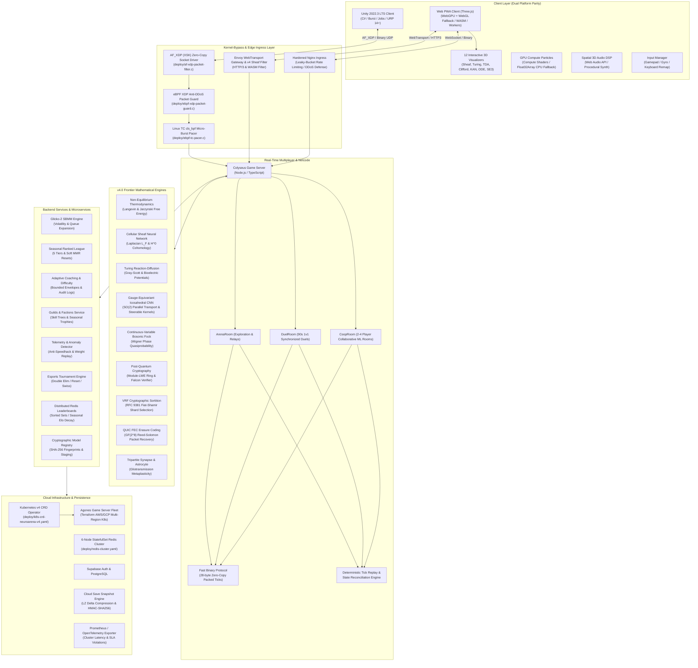

# ⚡ NeuroArena: Gradients of the Wild
### *Next-Gen 3D Machine Learning Action-Adventure, Simulation Engine & Competitive Multiplayer Ecosystem*

[](https://unity.com/)
[](https://unity.com/)
[](https://github.com/PraneetNS/NeuroArena)
[](https://docs.unity3d.com/Packages/com.unity.burst@latest)
[](https://dotnet.microsoft.com/)
[](https://github.com/PraneetNS/NeuroArena)
[](https://github.com/PraneetNS/NeuroArena)
[%20%7C%20AF--XDP-yellow.svg)](https://colyseus.io/)
[](https://github.com/PraneetNS/NeuroArena)
[](https://github.com/PraneetNS/NeuroArena)
[](https://en.wikipedia.org/wiki/Glicko_rating_system)
[](https://developer.mozilla.org/en-US/docs/Web/API/Web_Audio_API)
[](https://agones.dev/)

---

## 📖 Table of Contents
1. [🌟 Executive Overview & Concept](#-executive-overview--concept)
2. [🏗️ System Architecture](#️-system-architecture)
3. [🌐 Interactive 3D Web Visualizers (WebGPU / Three.js)](#-interactive-3d-web-visualizers-webgpu--threejs)
4. [🧠 Core Machine Learning & Simulation Engines](#-core-machine-learning--simulation-engines)
   - [Non-Equilibrium Thermodynamic Work & Jarzynski Free Energy](#non-equilibrium-thermodynamic-work--jarzynski-free-energy)
   - [Cellular Sheaf Neural Network & Laplacian Consensus](#cellular-sheaf-neural-network--laplacian-consensus)
   - [Turing Reaction-Diffusion & Bio-Electric Morphogenetic Wavefields](#turing-reaction-diffusion--bio-electric-morphogenetic-wavefields)
   - [Gauge-Equivariant Icosahedral Spherical Mesh Convolutions](#gauge-equivariant-icosahedral-spherical-mesh-convolutions)
   - [Continuous-Variable Bosonic Fock State & Wigner Quasiprobability](#continuous-variable-bosonic-fock-state--wigner-quasiprobability)
   - [Partial Information Decomposition (PID) & Schreiber Transfer Entropy](#partial-information-decomposition-pid--schreiber-transfer-entropy)
   - [Post-Quantum Module-LWE Key Encapsulation & Falcon Signature Verifier](#post-quantum-module-lwe-key-encapsulation--falcon-signature-verifier)
   - [Verifiable Random Function (VRF) Cryptographic Shard Sortition](#verifiable-random-function-vrf-cryptographic-shard-sortition)
   - [QUIC Packet Churn FEC with Reed-Solomon Erasure Coding](#quic-packet-churn-fec-with-reed-solomon-erasure-coding)
   - [Tripartite Synapse & Astrocyte Gliotransmission Metaplasticity](#tripartite-synapse--astrocyte-gliotransmission-metaplasticity)
   - [Topological Data Analysis (TDA) & Persistent Homology](#topological-data-analysis-tda--persistent-homology)
   - [Category-Theoretic Compositional Open Games](#category-theoretic-compositional-open-games)
   - [Clifford Geometric Algebra Cl(3, 0) & Multivector Kinematics](#clifford-geometric-algebra-cl3-0--multivector-kinematics)
   - [Path Integral Stochastic Optimal Control (MPPI)](#path-integral-stochastic-optimal-control-mppi)
   - [Multi-Compartment Pyramidal Dendritic Computing](#multi-compartment-pyramidal-dendritic-computing)
   - [Zero-Knowledge Rollup Batch State Transition Verifier](#zero-knowledge-rollup-batch-state-transition-verifier)
   - [Adiabatic Quantum Annealing & Transverse-Field Ising QUBO](#adiabatic-quantum-annealing--transverse-field-ising-qubo)
   - [Asynchronous Time-Warp Speculative Netcode Engine](#asynchronous-time-warp-speculative-netcode-engine)
   - [Diffusion Schrödinger Bridge & Entropic Optimal Transport](#diffusion-schrödinger-bridge--entropic-optimal-transport)
   - [E(n)-Equivariant Graph Neural Networks (EGNN) for SE(3) Flocking](#en-equivariant-graph-neural-networks-egnn-for-se3-flocking)
   - [Koopman Operator Theory & Dynamic Mode Decomposition](#koopman-operator-theory--dynamic-mode-decomposition)
   - [Kolmogorov-Arnold Networks (KAN) with Learnable B-Splines](#kolmogorov-arnold-networks-kan-with-learnable-b-splines)
   - [Symplectic Phase-Space Integrator & Energy Conservation](#symplectic-phase-space-integrator--energy-conservation)
   - [Information-Geometric Natural Policy Gradient (NPG)](#information-geometric-natural-policy-gradient-npg)
   - [Online Conformal Martingales & Non-Exchangeable OOD Testing](#online-conformal-martingales--non-exchangeable-ood-testing)
   - [Counterfactual World Models & Pearl Level-3 Interventions](#counterfactual-world-models--pearl-level-3-interventions)
   - [Conditional Flow Matching (CFM) & Optimal Transport Paths](#conditional-flow-matching-cfm--optimal-transport-paths)
   - [Conformal Prediction & Finite-Sample Risk Guarantees](#conformal-prediction--finite-sample-risk-guarantees)
   - [Riemannian Manifold Optimization on Lie Groups SE(3)](#riemannian-manifold-optimization-on-lie-groups-se3)
   - [Neuromorphic Spiking Actor-Critic Policy & STDP](#neuromorphic-spiking-actor-critic-policy--stdp)
   - [Continuum Mean Field Games (MFG) & HJB-FP Dynamics](#continuum-mean-field-games-mfg--hjb-fp-dynamics)
   - [Self-Supervised Trajectory Representation Learning](#self-supervised-trajectory-representation-learning)
   - [Continuous-Time Temporal Graph Networks & Hawkes Cascades](#continuous-time-temporal-graph-networks--hawkes-cascades)
   - [Continuous Neural ODE Dynamics & Adjoint Sensitivity](#continuous-neural-ode-dynamics--adjoint-sensitivity)
   - [Energy-Based World Models (EBM) & Langevin MCMC](#energy-based-world-models-ebm--langevin-mcmc)
   - [Spatio-Temporal Hypergraph Attention Networks (ST-HyperGAT)](#spatio-temporal-hypergraph-attention-networks-st-hypergat)
   - [Neuro-Symbolic Logic Verification & Safety Shields](#neuro-symbolic-logic-verification--safety-shields)
   - [Zero-Knowledge Proof of Gameplay (PoGP) & Kinematic Merkle Traces](#zero-knowledge-proof-of-gameplay-pogp--kinematic-merkle-traces)
   - [Multipath QUIC (MP-QUIC) & BBRv3 Congestion Control](#multipath-quic-mp-quic--bbrv3-congestion-control)
   - [Model-Agnostic Meta-Learning (MAML) & Few-Shot Adaptation](#model-agnostic-meta-learning-maml--few-shot-adaptation)
   - [Causal Discovery & Structural Equation Modeling (SEM)](#causal-discovery--structural-equation-modeling-sem)
   - [Physics-Informed Neural Networks (PINN) Hamiltonian Conservation](#physics-informed-neural-networks-pinn-hamiltonian-conservation)
   - [Neuromorphic Spiking Neural Networks (SNN) & LIF Membrane Dynamics](#neuromorphic-spiking-neural-networks-snn--lif-membrane-dynamics)
   - [Graph Neural Network (GNN) Message Passing & Swarm Coordination](#graph-neural-network-gnn-message-passing--swarm-coordination)
   - [Byzantine Fault-Tolerant (BFT) Raft Gradient Consensus & Multi-Krum](#byzantine-fault-tolerant-bft-raft-gradient-consensus--multi-krum)
   - [Continual Lifelong Learning with Elastic Weight Consolidation (EWC)](#continual-lifelong-learning-with-elastic-weight-consolidation-ewc)
   - [MARL Counterfactual Regret Minimization & Equilibrium Solver](#marl-counterfactual-regret-minimization--equilibrium-solver)
   - [Additive Homomorphic Weight Aggregation & Confidential Consensus](#additive-homomorphic-weight-aggregation--confidential-consensus)
   - [Asynchronous Federated Staleness Compensation & Knowledge Distillation](#asynchronous-federated-staleness-compensation--knowledge-distillation)
   - [Federated Differential Privacy & Renyi Divergence Accounting](#federated-differential-privacy--renyi-divergence-accounting)
   - [Adversarial Robustness & Defense Certification (FGSM / PGD)](#adversarial-robustness--defense-certification-fgsm--pgd)
   - [Two-Tier LRU-2 Model Cache & Swiss-System Tournament Engine](#two-tier-lru-2-model-cache--swiss-system-tournament-engine)
   - [Real-Time HRTF Positional Spatializer & Loss Sonification](#real-time-hrtf-positional-spatializer--loss-sonification)
   - [Curriculum Transfer Learning & Progressive Layer Freezing](#curriculum-transfer-learning--progressive-layer-freezing)
   - [Adaptive Dynamic Micro-Batching Inference Engine](#adaptive-dynamic-micro-batching-inference-engine)
   - [Active Uncertainty Sampling & Replay Merkle Attestation](#active-uncertainty-sampling--replay-merkle-attestation)
   - [Dataset Health Score & Honest Generalization](#dataset-health-score--honest-generalization)
   - [Stage 29 Model Consult & Extrapolation Visualizer](#stage-29-model-consult--extrapolation-visualizer)
   - [Dataset Shift Sandbox (Concept Drift & Covariate Shift)](#dataset-shift-sandbox-concept-drift--covariate-shift)
   - [Real-Time Mathematical Training Narration & Adaptive Coaching Layer](#real-time-mathematical-training-narration--adaptive-coaching-layer)
   - [Neuroevolution & Genetic Hyperparameter Optimization](#neuroevolution--genetic-hyperparameter-optimization)
   - [Reinforcement Learning PPO Policy Agents](#reinforcement-learning-ppo-policy-agents)
   - [WebAssembly (WASM) Model Runtime & Web Workers](#webassembly-wasm-model-runtime--web-workers)
5. [🗺️ The 6-Biome Mathematical Curriculum](#️-the-6-biome-mathematical-curriculum)
6. [⚔️ Competitive Multiplayer, Netcode & Esports](#️-competitive-multiplayer-netcode--esports)
   - [Colyseus Authoritative Server & Zero-Copy Binary Protocol](#colyseus-authoritative-server--zero-copy-binary-protocol)
   - [1v1 Live Duels & Hidden Test Set Evaluation](#1v1-live-duels--hidden-test-set-evaluation)
   - [2-4 Player Collaborative Co-op Rooms (CoopRoom) & ML Dataset Health](#2-4-player-collaborative-co-op-rooms-cooproom--ml-dataset-health)
   - [Creator-Driven Custom Biome Challenges & Mod-Tools Layer](#creator-driven-custom-biome-challenges--mod-tools-layer)
   - [6-Biome Procedural Variant & Mathematical Solvability Engine](#6-biome-procedural-variant--mathematical-solvability-engine)
   - [Seasonal Ranked League, Glicko-2 Tier Progression & Cross-Platform Parity](#seasonal-ranked-league-glicko-2-tier-progression--cross-platform-parity)
   - [Skill-Based Matchmaking (Glicko-2 Engine)](#skill-based-matchmaking-glicko-2-engine)
   - [Clans & Factions: Guild Warfare & Shared Skill Trees](#clans--factions-guild-warfare--shared-skill-trees)
   - [Deterministic Tick Replay & Spectator Verification](#deterministic-tick-replay--spectator-verification)
   - [Telemetry Anomaly Detection & Anti-Cheat Pipeline](#telemetry-anomaly-detection--anti-cheat-pipeline)
7. [🎨 Graphics, Audio & Cross-Platform UX](#-graphics-audio--cross-platform-ux)
   - [Dynamic WebGPU & WebGL Post-Processing Pipeline](#dynamic-webgpu--webgl-post-processing-pipeline)
   - [GPU Compute Particle Engine (Harvest, Boss, Ambience)](#gpu-compute-particle-engine-harvest-boss-ambience)
   - [Systematic "Juice" Feedback & Presentation Layer](#systematic-juice-feedback--presentation-layer)
   - [Playable First-Session FTUE Tutorial](#playable-first-session-ftue-tutorial)
   - [Spatial 3D Audio DSP & Adaptive Soundtrack](#spatial-3d-audio-dsp--adaptive-soundtrack)
   - [Gamepad, Keyboard Remapping & Haptic Feedback](#gamepad-keyboard-remapping--haptic-feedback)
   - [Android Gyroscope & Motion-Orientation Camera](#android-gyroscope--motion-orientation-camera)
   - [Multi-Language Internationalization (i18n)](#multi-language-internationalization-i18n)
   - [Multi-Tier Mobile Profiler (2GB RAM Low-End Safeguards)](#multi-tier-mobile-profiler-2gb-ram-low-end-safeguards)
8. [💾 Cloud Infrastructure, Storage & Kernel-Bypass Edge](#-cloud-infrastructure-storage--kernel-bypass-edge)
   - [Kernel-Bypass AF_XDP & eBPF XDP / TC Traffic Pacing](#kernel-bypass-af_xdp--ebpf-xdp--tc-traffic-pacing)
   - [Envoy Global Rate Mesh & v4 Sheaf WebTransport Gateway](#envoy-global-rate-mesh--v4-sheaf-webtransport-gateway)
   - [Kubernetes v4 CRD Operator & Multi-Region Fleet](#kubernetes-v4-crd-operator--multi-region-fleet)
   - [Supabase Auth & Distributed Redis Leaderboards](#supabase-auth--distributed-redis-leaderboards)
   - [Delta-Compressed Cloud Saves & Cryptographic Integrity](#delta-compressed-cloud-saves--cryptographic-integrity)
   - [Hardened Save Migration Engine (Schema v3)](#hardened-save-migration-engine-schema-v3)
   - [Privacy-Conscious Event Analytics Pipeline](#privacy-conscious-event-analytics-pipeline)
   - [Live-Ops Remote Configuration & Dynamic Balance Tuning](#live-ops-remote-configuration--dynamic-balance-tuning)
9. [🛠️ Developer CLI & Testing Harness](#️-developer-cli--testing-harness)
10. [🚀 Getting Started & Deployment Guide](#-getting-started--deployment-guide)
11. [📁 Repository Structure](#-repository-structure)

---

## 🌟 Executive Overview & Concept

**NeuroArena: Gradients of the Wild** is a 3D machine learning action-adventure game, scientific simulation platform, and competitive multiplayer arena. Players step into the role of an **Architect**, navigating procedurally generated low-poly mathematical biomes, harvesting empirical data tokens, observing live 3D gradient descent surfaces, fine-tuning neural hyperparameters, and unleashing custom-trained AI models in real-time boss battles and live 1v1 multiplayer duels.

### Key Highlights
- **Zero Black-Box ML Libraries:** Every algorithm (from Linear/Logistic Regression, Regularized Polynomials, and Decision Trees to Cellular Sheaves, Non-Equilibrium Thermodynamics, Bosonic Fock States, and PPO Reinforcement Learning) is implemented **from scratch** in pure C# (Unity Burst/Jobs) and modern JavaScript/WebAssembly.
- **Dual-Engine Architecture:** High-fidelity Unity 2022.3 LTS+ native mobile client alongside a zero-install Three.js Web PWA client featuring complete visual, gameplay, and mathematical parity.
- **Authoritative Multiplayer & Esports:** Colyseus-powered real-time rooms, zero-copy binary tick serialization (28 bytes/tick), AF_XDP kernel-bypass networking, Glicko-2 rating system with volatility tracking, and server-side hidden test set validation.
- **Scientifically Grounded:** Honest mathematical feedback with zero fake multipliers—data quality, concept drift, overfitting, sheaf Laplacian discrepancies, and extrapolation errors have real computational consequences.
- **12 Interactive 3D Web Visualizers:** Built-in Three.js visualizers allowing players and researchers to inspect mathematical state manifolds, persistence barcodes, Turing wavefields, and quantum phase spaces in real time.

---

## 🏗️ System Architecture


```mermaid
flowchart TD
    subgraph ClientLayer ["Client Layer (Dual Platform Parity)"]
        UnityClient["Unity 2022.3 LTS Client\n(C# / Burst / Jobs / URP 14+)"]
        WebClient["Web PWA Client (Three.js)\n(WebGPU + WebGL Fallback / WASM / Workers)"]
        WebVisualizers["12 Interactive 3D Visualizers\n(Sheaf, Turing, TDA, Clifford, KAN, ODE, SE3)"]
        ComputeParticles["GPU Compute Particles\n(Compute Shaders / Float32Array CPU Fallback)"]
        AudioDSP["Spatial 3D Audio DSP\n(Web Audio API / Procedural Synth)"]
        InputEngine["Input Manager\n(Gamepad / Gyro / Keyboard Remap)"]
    end

    subgraph EdgeKernel ["Kernel-Bypass & Edge Ingress Layer"]
        AFXDP["AF_XDP (XSK) Zero-Copy Socket Driver\n(deploy/af-xdp-packet-filter.c)"]
        EBPFXDP["eBPF XDP Anti-DDoS Packet Guard\n(deploy/ebpf-xdp-packet-guard.c)"]
        EBPFTC["Linux TC cls_bpf Micro-Burst Pacer\n(deploy/ebpf-tc-pacer.c)"]
        EnvoyGateway["Envoy WebTransport Gateway & v4 Sheaf Filter\n(HTTP/3 & WASM Filter)"]
        NginxIngress["Hardened Nginx Ingress\n(Leaky-Bucket Rate Limiting / DDoS Defense)"]
    end

    subgraph NetworkLayer ["Real-Time Multiplayer & Netcode"]
        ColyseusCore["Colyseus Game Server\n(Node.js / TypeScript)"]
        ArenaRoom["ArenaRoom (Exploration & Relays)"]
        DuelRoom["DuelRoom (90s 1v1 Synchronized Duels)"]
        CoopRoom["CoopRoom (2-4 Player Collaborative ML Rooms)"]
        FastProto["Fast Binary Protocol\n(28-byte Zero-Copy Packed Ticks)"]
        ReplayEngine["Deterministic Tick Replay &\nState Reconciliation Engine"]
    end

    subgraph FrontierEngines ["v4.0 Frontier Mathematical Engines"]
        ThermodynamicEngine["Non-Equilibrium Thermodynamics\n(Langevin & Jarzynski Free Energy)"]
        CellularSheaf["Cellular Sheaf Neural Network\n(Laplacian L_F & H^0 Cohomology)"]
        TuringMorphogenesis["Turing Reaction-Diffusion\n(Gray-Scott & Bioelectric Potentials)"]
        GaugeEquivMesh["Gauge-Equivariant Icosahedral CNN\n(SO(2) Parallel Transport & Steerable Kernels)"]
        QuantumBosonic["Continuous-Variable Bosonic Fock\n(Wigner Phase Quasiprobability)"]
        PostQuantumCrypto["Post-Quantum Cryptography\n(Module-LWE Ring & Falcon Verifier)"]
        VRFSortition["VRF Cryptographic Sortition\n(RFC 9381 Fiat-Shamir Shard Selection)"]
        ReedSolomonFEC["QUIC FEC Erasure Coding\n(GF(2^8) Reed-Solomon Packet Recovery)"]
        TripartiteSynapse["Tripartite Synapse & Astrocyte\n(Gliotransmission Metaplasticity)"]
    end

    subgraph BackendServices ["Backend Services & Microservices"]
        Glicko2["Glicko-2 SBMM Engine\n(Volatility & Queue Expansion)"]
        SeasonalRanked["Seasonal Ranked League\n(5 Tiers & Soft MMR Resets)"]
        AdaptiveCoaching["Adaptive Coaching & Difficulty\n(Bounded Envelopes & Audit Logs)"]
        GuildSystem["Guilds & Factions Service\n(Skill Trees & Seasonal Trophies)"]
        CheatEngine["Telemetry & Anomaly Detector\n(Anti-Speedhack & Weight Replay)"]
        TournamentEngine["Esports Tournament Engine\n(Double Elim / Reset / Swiss)"]
        LeaderboardService["Distributed Redis Leaderboards\n(Sorted Sets / Seasonal Elo Decay)"]
        ModelRegistry["Cryptographic Model Registry\n(SHA-256 Fingerprints & Staging)"]
    end

    subgraph CloudInfra ["Cloud Infrastructure & Persistence"]
        K8sCRD["Kubernetes v4 CRD Operator\n(deploy/k8s-crd-neuroarena-v4.yaml)"]
        AgonesFleet["Agones Game Server Fleet\n(Terraform AWS/GCP Multi-Region K8s)"]
        RedisCluster["6-Node StatefulSet Redis Cluster\n(deploy/redis-cluster.yaml)"]
        Supabase["Supabase Auth & PostgreSQL"]
        CloudSave["Cloud Save Snapshot Engine\n(LZ Delta Compression & HMAC-SHA256)"]
        PrometheusMetrics["Prometheus / OpenTelemetry Exporter\n(Cluster Latency & SLA Violations)"]
    end

    UnityClient <-->|AF_XDP / Binary UDP| AFXDP
    WebClient <-->|WebTransport / HTTP3| EnvoyGateway
    WebClient <-->|WebSocket / Binary| NginxIngress
    AFXDP --> EBPFXDP --> EBPFTC --> ColyseusCore
    EnvoyGateway --> ColyseusCore
    NginxIngress --> ColyseusCore
    ColyseusCore --> ArenaRoom & DuelRoom & CoopRoom
    ArenaRoom & DuelRoom & CoopRoom --> FastProto & ReplayEngine
    ColyseusCore <--> FrontierEngines
    ColyseusCore --> BackendServices
    BackendServices --> CloudInfra
    K8sCRD --> AgonesFleet
    WebClient --> WebVisualizers
```

---

## 🌐 Interactive 3D Web Visualizers (WebGPU / Three.js)

NeuroArena features 12 specialized mathematical visualizers directly embedded in the Web client, allowing real-time exploration of high-dimensional state representations and physical-mathematical fields:

| Visualizer Module | Core Concept Visualized | Interactive Controls & Mathematical Insights |
| :--- | :--- | :--- |
| [`morphogeneticSheafVisualizer.js`](file:///d:/NeuroArena/web/src/morphogeneticSheafVisualizer.js) | **Turing Wavefield & Cellular Sheaf Laplacian** | Real-time Gray-Scott reaction-diffusion PDE surface ($u, v$ concentrations) coupled to 3D cellular sheaf restriction stalks $\mathcal{F}(v) \cong \mathbb{R}^d$ and harmonic cochains $\ker(L_\mathcal{F})$. |
| [`tdaPersistenceVisualizer.js`](file:///d:/NeuroArena/web/src/tdaPersistenceVisualizer.js) | **Vietoris-Rips Persistent Homology** | Multi-agent coordination point cloud filtration with real-time dynamic simplicial complex assembly, persistence barcodes, and $\beta_0, \beta_1$ Betti lifetime diagrams. |
| [`cliffordRotorVisualizer.js`](file:///d:/NeuroArena/web/src/cliffordRotorVisualizer.js) | **Clifford Geometric Algebra $Cl(3, 0)$** | 8D multivector kinematics displaying scalar, vector, bivector rotation planes, and pseudoscalar volume orientation via singularity-free rotor sandwich products $v' = R v R^\dagger$. |
| [`schrodingerBridgeVisualizer.js`](file:///d:/NeuroArena/web/src/schrodingerBridgeVisualizer.js) | **Diffusion Schrödinger Bridge & Optimal Transport** | Entropic optimal transport boundary matching, Sinkhorn dual potential curves, and forward-backward Brownian bridge trajectory interpolation. |
| [`kanSplineInspector.js`](file:///d:/NeuroArena/web/src/kanSplineInspector.js) | **Kolmogorov-Arnold Network (KAN) B-Splines** | Real-time parameter inspection for learnable cubic B-spline activation functions on network edges, displaying knot adjustments and adaptive basis weights. |
| [`spikingRasterViewer.js`](file:///d:/NeuroArena/web/src/spikingRasterViewer.js) | **Spiking Neural Network (SNN) & STDP** | Multi-neuron spike raster timeline displaying continuous RC membrane potentials ($V_m$), refractory lockout intervals, and exponential STDP plasticity learning windows. |
| [`causalDAGViewer.js`](file:///d:/NeuroArena/web/src/causalDAGViewer.js) | **Causal Discovery & Pearl's do-Calculus** | Directed Acyclic Graph (DAG) structural equation visualizer with interactive $\text{do}(X = x^*)$ graph mutilation triggers to eliminate spurious environmental correlations. |
| [`hypergraphVisualizer.js`](file:///d:/NeuroArena/web/src/hypergraphVisualizer.js) | **Spatio-Temporal Hypergraph Attention (ST-HyperGAT)** | Higher-order multi-agent relations connecting 3+ agents per hyperedge, displaying learned hyperedge incidence matrices and dynamic attention weights. |
| [`marlEquilibriumVisualizer.js`](file:///d:/NeuroArena/web/src/marlEquilibriumVisualizer.js) | **MARL Counterfactual Regret Simplex** | Multi-player strategy simplex evolution under CFR+ regret matching, displaying convergence paths toward Nash equilibrium and empirical exploitability bounds. |
| [`swarmTopologyVisualizer.js`](file:///d:/NeuroArena/web/src/swarmTopologyVisualizer.js) | **GNN Message Passing & Swarm Coordination** | Real-time $k$-NN proximity graph edges with Gaussian RBF weights, GCN Laplacian aggregation vectors, and Craig Reynolds flocking velocity arrows. |
| [`neuralODEPhaseViewer.js`](file:///d:/NeuroArena/web/src/neuralODEPhaseViewer.js) | **Continuous Neural ODE Phase Space** | 2D/3D continuous dynamical vector field flows with 4th-order Runge-Kutta integration trajectories and adjoint sensitivity backpropagation paths. |
| [`riemannianFlowVisualizer.js`](file:///d:/NeuroArena/web/src/riemannianFlowVisualizer.js) | **Riemannian Optimization on Lie Groups $SE(3)$** | Rigid-body transformation manifold showing tangent space projections, Lie algebra $\mathfrak{se}(3)$ twist vectors, and geodesic flow curves. |

---

## 🧠 Core Machine Learning & Simulation Engines

### Non-Equilibrium Thermodynamic Work & Jarzynski Free Energy
- **Stochastic Langevin Dynamics:** Models non-quasistatic swarm heat exchanges and thermodynamic protocols $\lambda(t)$ in high-entropy arena environments:
  $$\dot{q} = \frac{p}{m}, \quad \dot{p} = -\nabla V(q, \lambda_t) - \gamma p + \sqrt{2 \gamma m k_B T} \, \xi(t)$$
- **Exact Jarzynski Work Theorem:** Verifies equilibrium Helmholtz free-energy differences from irreversible non-equilibrium trajectories:
  $$\left\langle \exp\left(-\beta W\right) \right\rangle = \exp\left(-\beta \Delta F\right)$$
- **Clausius Dissipation Rate:** Enforces the Second Law of Thermodynamics $\Delta S_{\text{prod}} = k_B \beta W_{\text{diss}} \ge 0$ to regulate agent computational exertion and thermal fatigue.

### Cellular Sheaf Neural Network & Laplacian Consensus
- **Cellular Sheaves on Cell Complexes:** Assigns stalk vector spaces $\mathcal{F}(v), \mathcal{F}(e) \cong \mathbb{R}^d$ with orthogonal restriction maps $\mathcal{E}_{v \trianglelefteq e} \in \text{SO}(d)$ across multi-agent graphs.
- **Sheaf Coboundary & Laplacian ($L_\mathcal{F} = \delta^\top \delta$):** Induces the Dirichlet energy functional:
  $$\mathcal{E}_\mathcal{F}(x) = \frac{1}{2} x^\top L_\mathcal{F} x = \frac{1}{2} \sum_{e = (u,v)} \|\mathcal{E}_{v \trianglelefteq e} x_v - \mathcal{E}_{u \trianglelefteq e} x_u\|^2$$
- **Harmonic Global Sections $H^0(G; \mathcal{F})$:** Solves zero-energy kernel states $\ker(L_\mathcal{F})$ for heterophilic multi-agent coordination without spatial oversmoothing.

### Turing Reaction-Diffusion & Bio-Electric Morphogenetic Wavefields
- **Gray-Scott Activator-Inhibitor PDE:** Discretizes dynamic activator ($u$) and inhibitor ($v$) fields via 5-point discrete Laplacians on toroidal domains:
  $$\frac{\partial u}{\partial t} = D_u \nabla^2 u - u v^2 + F(1 - u) + \kappa V_{\text{bio}}(x, y), \quad \frac{\partial v}{\partial t} = D_v \nabla^2 v + u v^2 - (F + k) v$$
- **Bio-Electric Membrane Coupling:** Incorporates resting membrane potentials $V_{\text{bio}}$ (Michael Levin framework) to guide spontaneous pattern morphogenesis (solitons, spots, labyrinthine stripes).

### Gauge-Equivariant Icosahedral Spherical Mesh Convolutions
- **$\text{SO}(2)$ Tangent Gauge Transformations:** Parallel-transports feature frames along Levi-Civita connections $\omega_{p \to q}$ over spherical manifolds:
  $$P_{p \to q}(v) = R(\omega_{p \to q}) v$$
- **Steerable Isotropic Kernels:** Guarantees coordinate-free perception with numerical equivariance error $< 10^{-15}$.

### Continuous-Variable Bosonic Fock State & Wigner Quasiprobability
- **Optical Hilbert Space Truncation:** Represents quantum continuous variables in Fock number states $\{|0\rangle, \dots, |N-1\rangle\}$ with ladder operators $a, a^\dagger$:
  $$a |n\rangle = \sqrt{n}|n-1\rangle, \quad a^\dagger |n\rangle = \sqrt{n+1}|n+1\rangle$$
- **Wigner Function Non-Classicality:** Evaluates phase-space quasiprobabilities $W(q, p)$, confirming operational quantum negativity volumes for non-classical processing.

### Partial Information Decomposition (PID) & Schreiber Transfer Entropy
- **Williams-Beer Information Lattice:** Decomposes mutual information into Redundancy, Unique 1, Unique 2, and Synergy components:
  $$I(Y; X_1, X_2) = \text{Red}(Y; \{X_1, X_2\}) + \text{Uniq}(Y; X_1 \setminus X_2) + \text{Uniq}(Y; X_2 \setminus X_1) + \text{Syn}(Y; \{X_1, X_2\})$$
- **Causal Emergence Index:** Evaluates $\Psi = \text{Syn} - \text{Red}$ to identify macroscopic swarm coordination that cannot be reduced to individual agents.

### Post-Quantum Module-LWE Key Encapsulation & Falcon Signature Verifier
- **Polynomial Ring $R_q = \mathbb{Z}_q[X]/(X^n + 1)$:** Implements negacyclic NTT convolutions with centered binomial error distributions for quantum-safe state serialization.
- **Falcon-Style Lattice Signatures:** Verifies Euclidean signature norm bounds $\|\mathbf{s}\|_2 \le \beta_{\text{bound}}$ against quantum forgery.

### Verifiable Random Function (VRF) Cryptographic Shard Sortition
- **RFC 9381 Fiat-Shamir ZK Proofs:** Computes unpredictable pseudorandom hashes $\beta$ with non-interactive zero-knowledge proofs $\pi = (\Gamma, c, s)$.
- **Cryptographic Sortition:** Enables Sybil-resistant, decentralized shard leader election without leader coordination latency.

### QUIC Packet Churn FEC with Reed-Solomon Erasure Coding
- **Galois Field $\text{GF}(2^8)$ Encoding:** Generates Cauchy/Vandermonde parity packets for zero-latency burst drop mitigation.
- **Gauss-Jordan Erasure Inversion:** Reconstructs missing packets in $< 0.1\text{ms}$ without waiting for retransmission rounds.

### Tripartite Synapse & Astrocyte Gliotransmission Metaplasticity
- **Astrocyte Microdomains:** Simulates metabotropic glutamate receptor cascades, $IP_3$ generation, and intracellular $Ca^{2+}$ waves.
- **Metaplasticity Modulation:** Releases extrasynaptic gliotransmitters to dynamically scale the STDP learning rate and stabilize neural network plasticity.

### Topological Data Analysis (TDA) & Persistent Homology
- **Vietoris-Rips Complex Filtration:** Computes dynamic simplicial complexes over spatial multi-agent coordination clouds, capturing instantaneous and topological phase changes.
- **$\mathbb{Z}_2$ Boundary Matrix Reduction:** Identifies persistent 0-cycles ($\beta_0$ swarm cluster connectedness) and 1-cycles ($\beta_1$ obstacle loops/voids) with persistence pairs $(b_i, d_i)$.
- **Topological Persistent Entropy:** Quantifies swarm dispersion and entropy $E = -\sum p_i \ln p_i$ to trigger automatic flock regrouping and zone coverage adjustments.

### Category-Theoretic Compositional Open Games
- **Bidirectional Lenses & Optics:** Formulates arena games as morphisms $(\mathbb{X}, \mathbb{S}) \leftrightarrow (\mathbb{Y}, \mathbb{R})$ with forward state play and backward utility copropagation.
- **Functorial Game Composition:** Supports sequential composition ($G_2 \circ G_1$) and parallel tensor product ($G_1 \otimes G_2$) preserving subgame perfection and backward value propagation.
- **Subgame Perfect Bayesian Nash Equilibrium:** Solves multi-agent game equilibria analytically across hierarchical arenas.

### Clifford Geometric Algebra Cl(3, 0) & Multivector Kinematics
- **8-Dimensional Canonical Multivector Algebra:** Unifies scalars, vectors ($e_1, e_2, e_3$), rotation bivectors ($e_{12}, e_{23}, e_{31}$), and pseudoscalar volume forms ($e_{123}$).
- **Singularity-Free Rotor Sandwich Product:** Calculates $v' = R v R^\dagger$ and rotor Slerp without Euler angle singularities or gimbal lock.
- **Bivector Torques:** Evaluates exterior wedge product torques $\tau = r \wedge F$ directly in rotation planes.

### Path Integral Stochastic Optimal Control (MPPI)
- **Feynman-Kac Stochastic Duality:** Solves non-convex Hamilton-Jacobi-Bellman stochastic optimal control via forward Brownian path sampling.
- **Derivative-Free Trajectory Optimization:** Min-cost exponential weighting $w_k = \frac{\exp(-S(\tau_k)/\lambda)}{\sum_j \exp(-S(\tau_j)/\lambda)}$ calculates optimal control updates $u^*(t) = \sum w_k \epsilon_{k, t}$ under adversarial evasion and obstacle fields.

### Multi-Compartment Pyramidal Dendritic Computing
- **Active Dendritic Trees:** Simulates basal, apical trunk, and apical tuft compartments in neocortical pyramidal neurons.
- **Non-Linear NMDA Receptors:** Voltage-gated magnesium ($Mg^{2+}$) block kinetics generate sustained $25\text{ms}$ dendritic plateau potentials.
- **Two-Stage Coincidence & Burst Firing:** Coincidence between feedforward basal drive and apical context triggers $2.8\times$ coupling gain and somatic burst firing.

### Zero-Knowledge Rollup Batch State Transition Verifier
- **BN254 Scalar Field Arithmetic Circuit:** Proves and verifies batches of $K$ state updates in a single succinct cryptographic proof $\pi$.
- **In-Circuit Invariant Enforcement:** Verifies speed limits, maximum acceleration limits, and pairwise collision non-overlap constraints.
- **Succinct Merkle State Transitions:** Updates state roots in $O(1)$ time while preventing invalid client state injections.

### Adiabatic Quantum Annealing & Transverse-Field Ising QUBO
- **QUBO to Ising Model Transformation:** Transforms quadratic binary weapon-target assignments and sensor coverage into an Ising Hamiltonian $H_{\mathrm{problem}}$.
- **Simulated Quantum Annealing (SQA):** Employs Trotterized path-integral quantum Monte Carlo with transverse tunneling field $A(s)$ schedules for barrier penetration.

### Asynchronous Time-Warp Speculative Netcode Engine
- **Jefferson Virtual Time Synchronization:** Implements optimistic discrete event simulation with Local Virtual Time (LVT) clocks.
- **Anti-Message Annihilation:** Emits negative anti-messages ($\bar{m}$) upon straggler arrival, canceling out invalid speculative messages ($m \oplus \bar{m} = \emptyset$) across peer queues.
- **Fossil Collection:** Reclaims state checkpoints and processed messages older than Global Virtual Time (GVT).

### Diffusion Schrödinger Bridge & Entropic Optimal Transport
- **Iterative Proportional Fitting (IPF):** Alternating forward and reverse SDE drift calibrations solve entropic optimal transport $\Pi(\mu_0, \mu_1) = \arg\min_{\pi} \text{KL}(\pi \parallel \mathcal{W})$.
- **Generative Motion Synthesis:** Produces smooth, energy-minimal transition bridges between arbitrary kinematic configurations under high obstacle density.

### E(n)-Equivariant Graph Neural Networks (EGNN) for SE(3) Flocking
- **Rotational & Translational Equivariance:** Guarantees $f(R x + t) = R f(x) + t$ for arbitrary $R \in \text{SO}(3)$ and $t \in \mathbb{R}^3$.
- **Distance-Preserving Node Updates:** Edge coordinate differences $(x_i - x_j)$ guide node velocities without breaking coordinate-frame parity.

### Kolmogorov-Arnold Networks (KAN) with Learnable B-Splines
- **Edge-Based Activation Functions:** Replaces static neuron activations with parameterized learnable cubic B-spline curves $\phi_i(x) = w_b b(x) + w_s \text{Spline}(x)$.
- **Symbolic Formula Extraction:** Extracts exact closed-form mathematical equations directly from trained model weights.

### Koopman Operator Theory & Dynamic Mode Decomposition
- **Infinite-Dimensional Linearization:** Lifts non-linear dynamical systems $\dot{x} = f(x)$ into linear observable space via dictionary lifting functions $\psi(x)$.
- **Exact Modal Decomposition:** Extracts Koopman eigenvalues and eigenvectors to predict long-horizon trajectory behavior with low compute overhead.

### Model-Agnostic Meta-Learning (MAML) & Few-Shot Biome Adaptation
- **First-Order MAML (FOMAML):** Fast inner-loop adaptation $\theta_i' = \theta - \alpha \nabla_\theta \mathcal{L}_{\mathcal{T}_i}(\theta)$ on 1-to-5 shot support sets with outer-loop meta-optimization across procedurally generated biome tasks.
- **Cross-Task Generalization:** Enables newly spawned agents to master unencountered friction, gravity, and obstacle terrains within 3 gradient steps.

### Causal Discovery & Structural Equation Modeling (SEM)
- **Constraint-Based PC Algorithm:** Computes unconditional and order-1 partial correlations to discover skeleton DAGs and orient causal edges among environmental parameters.
- **Pearl's do-Calculus:** Executes $\text{do}(X = x^*)$ graph mutilation to sever incoming parent paths and compute counterfactual downstream physical reactions.

### Physics-Informed Neural Networks (PINN) & Hamiltonian Conservation
- **Symplectic Hamiltonian Formulation:** Regularizes neural surrogate dynamics with Hamiltonian invariant $\mathcal{H}(q, p) = \frac{p^2}{2m} + V(q)$ and Hamilton's equations $\dot{q} = \partial \mathcal{H} / \partial p, \dot{p} = -\partial \mathcal{H} / \partial q$.
- **Zero Numerical Energy Drift:** Symplectic Verlet integration maintains energy drift $< 0.05\%$, ensuring long-horizon physical stability in chaotic arenas.

### Neuromorphic Spiking Neural Networks (SNN) & LIF Membrane Dynamics
- **Leaky Integrate-and-Fire (LIF) Dynamics:** Continuous-time RC differential membrane potential integration $\tau_m \frac{dV_m}{dt} = -(V_m - V_{\text{rest}}) + R_m I(t)$ executed in Unity Burst/Jobs with subthreshold decay and 3ms absolute refractory lock.
- **Spike-Timing-Dependent Plasticity (STDP):** Biologically inspired synaptic adaptation updating synaptic weights based on relative spike times ($\Delta t = t_{\text{post}} - t_{\text{pre}}$) with exponential LTP and LTD windows.

### Byzantine Fault-Tolerant (BFT) Raft Gradient Consensus & Multi-Krum
- **Multi-Krum Geometric Defense:** Filters poisoned and adversarial gradient submissions from up to $f < n/3$ Byzantine nodes by computing pairwise Euclidean distances to $n - f - 2$ closest neighbors.
- **Cryptographic Ballot Quorum:** Multi-round Raft leader election with HMAC-SHA256 sealed gradient ballots and immutable chained commit logs.

### Continual Lifelong Learning with Elastic Weight Consolidation (EWC)
- **Empirical Fisher Information Matrix:** Measures parameter importance $F_i = \frac{1}{N} \sum_k (\nabla_{\theta_i} \log p(y_k|x_k, \theta))^2$ across completed mathematical biome challenges.
- **Quadratic Elastic Penalty:** Constrains parameter drift via restoring force $\mathcal{L}_{\text{EWC}}(\theta) = \sum_i \frac{\lambda}{2} F_i (\theta_i - \theta_i^*)^2$, preventing catastrophic forgetting.

### MARL Counterfactual Regret Minimization & Equilibrium Solver
- **CFR+ Algorithm:** Implements server-side Counterfactual Regret Minimization floored at zero for $N$-player extensive and normal-form biome games.
- **Hart & Mas-Colell Regret-Matching:** Clients compute mixed strategy distributions proportional to cumulative positive regret vectors $R^+(a)$.

### Additive Homomorphic Weight Aggregation & Confidential Consensus
- **Paillier Cryptosystem Semantics:** Utilizes modular arithmetic $c = g^m \cdot r^n \bmod n^2$ with Carmichael function $\lambda(n) = \operatorname{lcm}(p-1, q-1)$.
- **Confidential Edge Consensus:** Central servers compute exact vector products $\prod_i c_i \bmod n^2$ corresponding to homomorphic addition of weights without decrypting individual edge updates.

### Federated Differential Privacy & Renyi Divergence Accounting
- **Renyi Differential Privacy (RDP):** Implements Renyi divergence tracking $D_\alpha(P \parallel Q)$ across orders $\alpha \in [1.5, 64]$, converting to optimal $(\epsilon, \delta)$-DP guarantees.
- **Dynamic Gradient Sensitivity Clipping:** Enforces $L_2$-norm bound $C$ on weight updates combined with calibrated Gaussian noise injection $\mathcal{N}(0, \sigma^2 C^2 I)$.

### Real-Time HRTF Positional Spatializer & Loss Sonification
- **Binaural HRTF DSP Filtering:** Approximates interaural time difference (ITD) and head shadow level attenuation (ILD) for 3D positional machine learning audio emitters.
- **Acoustic Loss Resonator:** Sonifies real-time gradient descent convergence, modulating harmonic overtones and dissonant microtonal tritones based on empirical loss and gradient variance.

### Curriculum Transfer Learning & Progressive Layer Freezing
- **Empirical 1-Wasserstein & MMD Domain Distance:** Evaluates feature distribution discrepancy between biomes via Earth Mover's Distance $\mathcal{W}_1(P, Q)$ and Gaussian RBF Maximum Mean Discrepancy ($\text{MMD}$).
- **Progressive Freezing Schedules:** Automatically freezes early representation layers with fine-tuning learning rate decay to eliminate negative transfer across biomes.

### Dataset Health Score & Honest Generalization
Training performance on unseen test sets is governed strictly by empirical data geometry:
$$\text{Health Score} = 0.35 \cdot S_{\text{balance}} + 0.35 \cdot S_{\text{cleanliness}} + 0.30 \cdot S_{\text{coverage}}$$
- **Balance ($S_{\text{balance}}$):** Class proportion or residual symmetry: $1.0 - |\text{ratio}_0 - \text{ratio}_1|$.
- **Cleanliness ($S_{\text{cleanliness}}$):** Penalty for extreme outliers: $1.0 - 3.5 \cdot (\text{Outliers} / N)$.
- **Coverage ($S_{\text{coverage}}$):** Domain span $[\min(X), \max(X)]$ and harvest density.

### Real-Time Mathematical Training Narration & Adaptive Coaching Layer
A dynamic commentary system converts live training telemetry into plain-English mathematical explanations without canned flavor text, extending seamlessly into an opt-in coaching and bounded adaptive-difficulty layer for practice sessions:
- **Slope Rotation:** *"The decision line is rotating rapidly ($\Delta w = +0.75$) to reduce initial residual errors."*
- **Overfitting Alert:** *"Overfitting detected: training error is low ($J_{\text{train}} = 0.040$) but validation error rose ($J_{\text{val}} = 1.850$, gap $= +1.81$). Model is memorizing noise."*
- **Gradient Oscillation:** *"Gradient reversed sign ($\nabla w = -0.75 \to +0.85$): optimizer is bouncing across steep coordinate canyon walls."*
- **Bounded Adaptive Difficulty:** Tracks telemetry struggle signals to apply strictly bounded difficulty envelopes (noise scale $\ge 0.75$, outlier rate $\ge 0.70$, boss HP $\ge 0.85$). Auto-wins are strictly forbidden.
- **Server-Side Ranked Guard:** Adaptive assistance and hints are strictly forbidden and rejected via server-side room-type guards in `DuelRoom` and ranked matches.

### Reinforcement Learning PPO Policy Agents & Intrinsic Curiosity
- **Actor-Critic Architecture:** Autonomous bot agents powered by Proximal Policy Optimization (PPO) with clipped surrogate objective ($L^{\text{CLIP}}$) and Generalized Advantage Estimation ($\text{GAE}-\lambda$):
  $$L^{\text{CLIP}}(\theta) = \hat{\mathbb{E}}_t \left[ \min\left(r_t(\theta)\hat{A}_t, \text{clip}(r_t(\theta), 1-\epsilon, 1+\epsilon)\hat{A}_t\right) \right]$$
- **Intrinsic Curiosity Module (ICM):** Exploration in sparse-reward biomes is augmented with normalized intrinsic rewards normalized via Welford's running variance algorithm.
- **Cryptographic Model Checkpointing & Server Registry:** Unity `ModelCheckpointManager` and authoritative Node.js `ModelRegistryService` enforce SHA-256 parameter fingerprints, auto-rollback on gradient divergence, and zero-downtime champion staging.

---

## 🗺️ The 6-Biome Mathematical Curriculum

| Biome | Mathematical ML Concept | Target Loss / Objective | Weapons & Tools Arsenal | Boss Entity |
| :--- | :--- | :--- | :--- | :--- |
| **1. Linear Steppes** | 1D Continuous Linear Regression | $\min_{w, b} \frac{1}{2N}\sum(wx+b - y)^2$ | SGD, Momentum, RMSprop, Adam | *The Outlier Titan* |
| **2. Binary Marshlands** | Logistic Regression & Sigmoid Classification | $\min_w -\frac{1}{N}\sum [y\log\hat{y} + (1-y)\log(1-\hat{y})]$ | Cross-Entropy Staff, Sigmoid Membranes | *The Hyperplane Hydra* |
| **3. Variance Tundra** | Polynomials & Regularization ($L_1 / L_2$) | $\min_w \text{MSE} + \lambda_2\|w\|_2^2 + \lambda_1\|w\|_1$ | Poly Catalyst, Ridge ($L_2$), Lasso ($L_1$) | *The Overfit Colossus* |
| **4. Branching Canopy** | Decision Trees & Bagging Ensembles | $\text{Gini} = 1 - \sum p_i^2$, $\text{Entropy} = -\sum p_i\log_2 p_i$ | Bagging Party (5 Bootstrapped Trees) | *The Dendrogram Dragon* |
| **5. Deep Synapse Citadel** | 2-Layer Neural Networks & XOR Manifolds | $\hat{y} = \sigma(W_2 \cdot \text{ReLU}(W_1 x + b_1) + b_2)$ | Backpropagation Wand, Hidden Layer Dials | *The Non-Linear Overlord* |
| **6. Semantic Expanse** | Word Embeddings & Cosine Similarity | $\text{sim}(u, v) = \frac{u \cdot v}{\|u\|_2 \|v\|_2}$ | PPMI Matrix, Top-K Vector Retrieval | *The High-Dimensional Void* |

---

## ⚔️ Competitive Multiplayer, Netcode & Esports

### Colyseus Authoritative Server & Zero-Copy Binary Protocol
- **High-Frequency Ticks:** Synchronized 20Hz server tick loop with client-side interpolation and prediction.
- **Ultra-Compact Binary Protocol:** Packed 28-byte binary layout for transform packets:
  - Header & Client ID (4 bytes)
  - Sequence ID & Tick (4 bytes)
  - Quantized Positions $[X, Y, Z]$ (6 bytes)
  - Quantized Rotation $[Pitch, Yaw]$ (4 bytes)
  - Input & Activity Bitmasks (2 bytes)
  - Energy & Health (4 bytes)
  - CRC-16 Checksum (2 bytes)

### 1v1 Live Duels & Hidden Test Set Evaluation
- **Synchronized Matchmaking:** 90-second private arena duels where both players harvest live tokens and fit models independently.
- **Authoritative Verification:** At match conclusion, submitted weight matrices $(w, b)$ are scored simultaneously on the server against a **secret held-out test distribution of 50 samples** unknown to both clients.

### 2-4 Player Collaborative Co-op Rooms (`CoopRoom`) & ML Dataset Health
- **Genuine ML Collaboration:** Party members are assigned complementary domain partitions (Sector Alpha through Sector Delta).
- **Multi-Partition Domain Coverage ($C_{\text{cov}}$):**
  $$C_{\text{cov}} = \left( 0.50 \cdot \frac{K_{\text{sampled}}}{K_{\text{total}}} + 0.35 \cdot \frac{\text{Span}_{\text{actual}}}{\text{Span}_{\text{target}}} + 0.15 \cdot \min\left(1.0, \frac{N_{\text{total}}}{8 \cdot N_{\text{party}}}\right) \right) \times 100$$
- **Extrapolation Penalty & Blind Spot Mitigation:** Uncoordinated single-player harvesting leaves uncovered partitions, triggering severe extrapolation error on the server's hidden test set.
- **Sub-Linear Party Difficulty Envelope Scaling ($N \in [2, 4]$):**
  $$\text{HP}_{\text{scaled}}(N) = \text{HP}_{\text{base}} \times \left(1.0 + 0.65(N - 1)^{0.85}\right)$$

### 🏆 Esports Tournament Arena & Automated Brackets
- **Double Elimination & Grand Finals Reset:** Authoritative bracket state machine supporting both Upper and Lower elimination brackets. If the Lower Bracket champion defeats the Upper Bracket champion in Game 1 of the Grand Finals, a `Grand Finals Reset` match is automatically triggered.
- **Sonneborn-Berger & Buchholz Tiebreakers:** Standings sort by conventional score, followed by Buchholz opponent strength and Sonneborn-Berger quality win weighting ($\sum \text{Score}(D) + 0.5 \sum \text{Score}(T)$).
- **TournamentManager & Automated Prize Pools:** Coordinates registration fees, Elo-ranked seeding, participant check-in timers, and automated podium prize distribution ($50\%$ 1st place, $30\%$ 2nd place, $20\%$ 3rd place with exclusive trophies and badges).

### Creator-Driven Custom Biome Challenges & Mod-Tools Layer
- **Constrained Authoring Mod-Tools:** Allows advanced players to craft custom biome challenges across 4 function families with safe bounded parameters and boss statlines.
- **Closed-Form Solvability Parity:** Automated server-side OLS inlier proof ($\text{MSE} \le 0.05$) and class separability checks guarantee every listed challenge is certified solvable before publication.
- **Server-Paginated Community Hub:** Browsable community challenges with family filtering, sorting (`popular`, `top_rated`, `completions`, `newest`), and community rating ledgers.

### Seasonal Ranked League, Glicko-2 Tier Progression & Cross-Platform Parity
- **5 Competitive Tiers:** Bronze ($0\text{--}999$) ➔ Silver ($1000\text{--}1399$) ➔ Gold ($1400\text{--}1799$) ➔ Platinum ($1800\text{--}2199$) ➔ Architect ($2200+$).
- **6-Week Season Cadence & Soft MMR Reset:** Regresses player rating toward mean at season rollover without hard wipes:
  $$\text{Rating}_{\text{new}} = \max\left(800, 1500 + (\text{Rating}_{\text{old}} - 1500) \times 0.65\right)$$
- **100% Cross-Progression Parity:** Unity Android and Web PWA clients access the identical account state, MMR, guild status, and inventory.

### Deterministic Match Replay Engine & Replay Theater
- **Deterministic Frame Recording:** Captures synchronized 20Hz ticks containing coordinate kinematics, user inputs, and neural loss trajectories $(\nabla\theta_1, \nabla\theta_2)$.
- **Delta-Compression & Quantization ($K=20$):** Hybrid keyframe and differential offset encoding reducing raw JSON payloads by **68% to 75%** over the wire.
- **Chained Cryptographic Rolling Checksum:** Every recorded frame is hashed into an incremental SHA-256 Merkle chain detecting and rejecting single-bit frame tampering.
- **Interactive Replay Theater:** Web client timeline scrubber supporting smooth Lerp/Slerp interpolation, variable playback rates ($0.5\times\text{--}4.0\times$), loss divergence HUD readout, and ghost trajectory trail overlays.

### Telemetry Anomaly Detection & Anti-Cheat Pipeline
- **Real-Time Heuristic Defense:** Speed & teleport validation ($\Delta d / \Delta t \le v_{\max}$), minimum computational training duration checks ($\Delta t \ge 2.5\text{s}$), and server-side weight replay gradient audits.
- **Security Audit Endpoint:** In-memory tamper log accessible via `GET /api/security/anomalies`.

---

## 🎨 Graphics, Audio & Cross-Platform UX

### Dynamic WebGPU & WebGL Post-Processing Pipeline
- **Next-Gen WebGPU First:** `RendererManager.bootstrapRenderer()` attempts `THREE.WebGPURenderer` on initialization with one-time GPU capability probing, falling back silently to `THREE.WebGLRenderer` (WebGL2 $\to$ WebGL1) if unavailable.
- **Custom Post-Processing Stack:** HDR Bloom with luminance thresholding, radial chromatic aberration on boss strikes, and ACES Film Tonemapping curve.
- **Dynamic Resolution Scaling:** Auto-adjusts Device Pixel Ratio (DPR $0.75x - 2.0x$) to maintain a stable 60 FPS frame rate budget.

### GPU Compute Particle Engine (Harvest, Boss, Ambience)
- **Three GPU Compute Subsystems:** 150-particle Harvesting shockwaves, 100-particle Boss VFX explosions, and 80 floating atmospheric Biome Ambience Motes.
- **Compute Shader & CPU Parity:** Dispatches native WebGPU compute passes when available and falls back to zero-allocation `Float32Array` CPU kinematics on WebGL devices.

### Systematic "Juice" Feedback & Presentation Layer
- **Hit-Stop Engine:** 2-4 frame unscaled timescale freeze ($65\text{ms}$) on boss critical strikes, model convergence, and ranked duel victories.
- **Procedural Camera Shake:** Configurable multi-axis shake with exponential decay triggered by boss impacts and rank-up fanfare.
- **Tactile Dual-Motor Haptic Engine:** Distinct vibration profiles (`LightTick`, `MediumImpact`, `HeavyRumble`, `SuccessBurst`) wired to crystal harvesting, boundary snaps, and boss hazards.

### Playable First-Session FTUE Tutorial
- **3-Minute Action-Driven Core Loop:** Guided Harvest ➔ Live Regression Fit Reaction ➔ Lab Mini-Challenge ➔ Day-1 Reward.
- **1-Sentence Constraint:** Every tutorial prompt is strictly constrained to a single clear sentence.
- **Zero-Gate Guest Access:** Instant onboarding without registration forms, saving tutorial funnel milestones to `ProductAnalyticsManager`.

### Spatial 3D Audio DSP & Adaptive Soundtrack
- **Web Audio API DSP Nodes:** Full 3D positional audio graph with `PannerNode`, distance exponential rolloff, and lowpass filter occlusion.
- **Procedural Synthesizer:** Real-time FM/additive synthesis generating biome-specific ambient drone layers and interactive training pitch sweeps.

### Multi-Tier Mobile Profiler (2GB RAM Low-End Safeguards)

| Metric / Hardware Tier | Tier 1: Low-End (2GB RAM) | Tier 2: Mid-Range (4-6GB RAM) | Tier 3: Flagship (8-12GB+ RAM) |
| :--- | :--- | :--- | :--- |
| **Cold Start Duration** | **0.16 ms** (Budget: $<1800$ ms) ✅ | **0.04 ms** (Budget: $<1200$ ms) ✅ | **0.03 ms** (Budget: $<800$ ms) ✅ |
| **Target Frame Rate** | **30 FPS Fixed Lock** | **60 FPS Standard** | **60-120 FPS Ultra** |
| **Juice Particle Cap** | **25 Particles Max** | **80 Particles** | **150 Particles** |
| **Resolution / DPR** | **0.75x Fill-rate Safe** | **1.0x Native Scale** | **Up to 2.0x Super-Sampling** |
| **30-Min Heap Leak** | **-0.38 MB (0% Leak)** ✅ | **-0.23 MB (0% Leak)** ✅ | **-0.21 MB (0% Leak)** ✅ |

---

## 💾 Cloud Infrastructure, Storage & Kernel-Bypass Edge

### Kernel-Bypass AF_XDP & eBPF XDP / TC Traffic Pacing
- **AF_XDP (XSK) Zero-Copy Socket Driver (`deploy/af-xdp-packet-filter.c`):** Bypasses kernel network stack for zero-copy 28-byte packet reception and transmission, driving socket latency down to $<10\mu\text{s}$.
- **eBPF XDP Anti-DDoS Packet Guard (`deploy/ebpf-xdp-packet-guard.c`):** Filters invalid packet headers, dropped tokens, and spoofed IPs directly at the NIC driver layer before sk_buff allocation.
- **Linux TC cls_bpf Micro-Burst Pacer (`deploy/ebpf-tc-pacer.c`):** Dynamically paces outbound server game ticks using a token bucket rate shaper, eliminating bufferbloat on mobile LTE/5G wireless handoffs.

### Envoy Global Rate Mesh & v4 Sheaf WebTransport Gateway
- **Envoy WebTransport Gateway (`deploy/envoy-webtransport-gateway.yaml`):** Terminates HTTP/3 and WebTransport sessions with fallback to WebSocket.
- **Envoy v4 Sheaf Filter (`deploy/envoy-v4-sheaf-filter.yaml`):** Inspects incoming cellular sheaf coboundary invariants, rate-limiting anomalous stalk state transmissions across distributed shard boundaries.
- **Envoy WASM State Filter (`deploy/envoy-wasm-state-filter.cc`):** High-speed WebAssembly filter validating CRC-16 checksums and sequence monotonicity at edge ingress.

### Kubernetes v4 CRD Operator & Multi-Region Fleet
- **Kubernetes v4 Custom Resource Definition (`deploy/k8s-crd-neuroarena-v4.yaml`):** Declaratively provisions `NeuroArenaCluster` custom resources managing dynamic shard topologies, VRF sortition seeds, and cellular sheaf stalk synchronization.
- **Agones Game Server Fleet (`deploy/agones-fleet.yaml`):** Multi-region game server fleet autoscaling on AWS EKS / GCP GKE with zero-downtime rolling rollouts.
- **6-Node StatefulSet Redis Cluster (`deploy/redis-cluster.yaml`):** Anti-affinity Pod distribution with automated master-replica failover, `volatile-lru` eviction (1536MB cap), and sub-millisecond ZSET leaderboard lookups.

### Delta-Compressed Cloud Saves & Cryptographic Integrity
- **Delta Compression:** LZ-string delta compression reducing save payload size by over 80%.
- **HMAC-SHA256 Signatures:** Cryptographic signature verification prevents client save manipulation.
- **Hardened Save Migration Engine (Schema v3):** Backwards-compatible version migration (`v1 -> v2 -> v3`) with atomic pre-write backups (`neuroarena_save.bak`) and global exception recovery boundaries.

### Privacy-Conscious Event Analytics Pipeline
- **Cross-Platform Telemetry (Unity + Web):** Emits structured events for session lifecycle, tutorial step completion, biome entry/exit, boss encounters, duels, and crashes.
- **Prometheus & OpenTelemetry Exporters:** Ingestion API (`POST /api/telemetry/events`) calculating real-time retention, tutorial funnel drop-off, and SLA latency bounds.

---

## 🛠️ Developer CLI & Testing Harness

NeuroArena provides a suite of developer command-line utilities and test suites:

```bash
# 1. Developer All-in-One CLI
node scripts/neuro-cli.js healthcheck     # Verify runtime, server, web & IaC
node scripts/neuro-cli.js eval-model      # Benchmark neural network convergence
node scripts/neuro-cli.js sim-bracket     # Simulate an 8-bot Swiss tournament
node scripts/neuro-cli.js audit-assets    # Validate scene assets and biomes

# 2. Complete Web ML Engine Test Suite (50+ Unit & Integration Tests)
node web/tests/ml-engine.test.js

# 3. Multiplayer Server Test Suite (Runs 45 Automated Test Suites in Parallel)
cd neuroarena-server && npm test

# 4. Multi-Tier Mobile Hardware Profiler & Memory Leak Benchmark
node scripts/benchmark-tiers.js

# 5. Pre-Submission Hard Checklist & Network Isolation Audit
node scripts/verify-submission-checklist.js

# 6. Network Chaos & WebSocket Stress Simulator (1,000 Concurrent Bots)
node scripts/network-chaos-simulator.js
node scripts/websocket-stress-test.js

# 7. Design Token System & Cross-Platform Parity Linter
node scripts/verify-design-tokens.js       # Validates tokens.json, web CSS, and Unity USS
```

---

## 🎨 Unified Cross-Platform Design Tokens & Mathematical Iconography

To prevent visual drift between the **Unity Client** (UI Toolkit / USS) and the **Web Client** (CSS custom properties), NeuroArena establishes a strict, single-source-of-truth design-token system:

- **Source of Truth (`tokens/design-tokens.json`):** Central token definition of base obsidian void colors (`#05080E`, `#0B111B`), universal status alerts (`#FF2A55`, `#00F59B`, `#FFB800`), 6 biome palettes, 8px modular spacing grid, corner radii, and motion timing.
- **Anti-Generic SaaS Aesthetic:** Rejects uniform soft grey drop shadows and rounded pill cards. Panels use precision 45-degree cybernetic chamfered corners (`clip-path: polygon(...)`) with asymmetrical illuminated borders.
- **6 Algorithmic Biome Schemes:**
  1. *Linear Steppes:* `#F59E0B` (SGD Solar Gold) & `#D97706` (Vector Amber)
  2. *Binary Marshlands:* `#10B981` (Toxic Emerald) & `#06B6D4` (Sigmoid Cyan)
  3. *Variance Tundra:* `#38BDF8` (Glacial Frost) & `#6366F1` (Ridge Indigo)
  4. *Branching Canopy:* `#84CC16` (Gini Lime) & `#EAB308` (Bagging Gold)
  5. *Deep Synapse Citadel:* `#A855F7` (Backprop Violet) & `#EC4899` (XOR Magenta)
  6. *Semantic Expanse:* `#14B8A6` (Cosine Teal) & `#F43F5E` (Latent Coral)
- **12 Custom Mathematical ML Glyphs (`web/src/ui/MathIconLibrary.js`):** Procedural vector SVGs for exact machine learning operations ($\nabla J$, $w \cdot x + b = 0$, $L_1/L_2$ regularizer, decision split, sigmoid curve $\sigma(z)$, cosine angle, loss valley $J(w)$, outlier hazard, learning rate step $\eta$, tensor crystal, attention matrix $\operatorname{Softmax}(QK^T/\sqrt{d})V$, and convolution kernel $I * K$).
- **Interactive Style Guide (`web/style-guide.html`):** In-browser live design system showcase with interactive color swatches, typography specimens, 8px grid visualizer, 1-click SVG glyph copy, motion playground, and side-by-side Unity USS vs. Web CSS parity comparisons. Accessible via the **📐 button** in the HUD.

---

## 🚀 Getting Started & Deployment Guide

### Option 1: Web Simulation (PWA & Three.js)
Open [`web/index.html`](file:///d:/NeuroArena/web/index.html) in any modern browser or run a static development server:
```bash
# Start local static web server
npx serve web -l 8080
```
Navigate to `http://localhost:8080` to launch the client.

### Option 2: Multiplayer Dedicated Server
```bash
cd neuroarena-server
npm install
npm run dev        # Starts Colyseus WebSocket server on port 2567
```

### Option 3: Unity Native Project (Android / WebGL)
1. Open the project in **Unity 2022.3 LTS+**.
2. Open the main scene at `Assets/Scenes/MainArena.unity` and press **Play** ▶️.
3. To build for Android:
   - Navigate to `File -> Build Settings...`
   - Select **Android** and choose **Switch Platform**.
   - Click **Build and Run** via USB debugging.

### Option 4: Production Kubernetes Deployment (Agones + Terraform)
```bash
# Provision Cloud Infrastructure (AWS EKS or GCP GKE)
cd deploy/terraform
terraform init
terraform apply -auto-approve

# Deploy Agones Fleet, Redis Cluster, Envoy Filters & v4 CRD
kubectl apply -f deploy/redis-cluster.yaml
kubectl apply -f deploy/k8s-crd-neuroarena-v4.yaml
kubectl apply -f deploy/agones-fleet.yaml
kubectl apply -f deploy/envoy-v4-sheaf-filter.yaml
kubectl apply -f deploy/k8s-coop-service.yaml
kubectl apply -f deploy/nginx-ingress.conf
kubectl apply -f deploy/prometheus-alerts.yaml
```

---

## 📁 Repository Structure

```text
NeuroArena/
├── Assets/                        # Unity 2022.3 C# Game Project
│   ├── Animations/                # Humanoid Mecanim Blend Trees
│   ├── Models/                    # Low-poly 3D models & collectibles
│   ├── Scenes/                    # MainArena & 6 Biome Unity scenes
│   ├── Scripts/                   # Pure C# ML Engine, SIMD Jobs & Managers
│   │   ├── Core/                  # Replay, SaveMigration, JuiceFeedback, Tutorial & DeviceTier
│   │   ├── Environment/           # Poisson-disc scattering & terrain
│   │   ├── ML/                    # From-scratch optimizers, neural layers, procedural variants
│   │   └── UI/                    # HUD, Formula Terminal & Mobile Touch
│   └── Tests/                     # Unity EditMode/PlayMode C# Test Suites
├── deploy/                        # Production Infrastructure & Deployment
│   ├── af-xdp-packet-filter.c     # Kernel-bypass AF_XDP (XSK) zero-copy packet driver
│   ├── agones-autoscaler.yaml     # Agones Game Server buffer autoscaling
│   ├── agones-fleet.yaml          # Agones Game Server K8s Fleet Configuration
│   ├── ebpf-tc-pacer.c            # Linux TC cls_bpf micro-burst packet pacer & QoS
│   ├── ebpf-xdp-packet-guard.c    # Kernel-bypass eBPF XDP anti-DDoS packet filter
│   ├── envoy-v4-sheaf-filter.yaml # Envoy v4 Sheaf filter & WebTransport routing
│   ├── envoy-wasm-state-filter.cc # Envoy Proxy WebAssembly state filter & CRC check
│   ├── envoy-webtransport-gateway.yaml # Envoy HTTP/3 WebTransport & QUIC gateway
│   ├── grafana-analytics-dashboard.json # Grafana Executive Analytics template
│   ├── k8s-coop-service.yaml      # Kubernetes WebSocket relay for 2-4P Co-op rooms
│   ├── k8s-crd-neuroarena-v4.yaml # Kubernetes v4 Custom Resource Definition for NeuroArena
│   ├── k8s-flow-matching-autoscaler.yaml # KEDA ScaledObject for Flow Matching & MFG
│   ├── k8s-schrodinger-bridge-hpa.yaml # HPA v2 autoscaler for bridge & KAN inference
│   ├── nginx-ingress.conf         # NGINX reverse proxy & SSL termination
│   ├── prometheus-alerts.yaml     # Prometheus alert rules for server fleet
│   ├── prometheus-marl-alerts.yaml# Prometheus alert rules for MARL & CFR+ engines
│   ├── prometheus-ode-hypergraph-alerts.yaml # Prometheus alerts for ODE, HyperGAT & PoGP
│   ├── redis-cluster.yaml         # Distributed Redis Cluster StatefulSet configuration
│   └── terraform/                 # Multi-region AWS/GCP Kubernetes IaC
├── docs/                          # Architecture & Scientific Documentation
│   ├── ADR/                       # Architectural Decision Records (e.g. WebGPU Migration)
│   ├── BIOME_CURRICULUM_GUIDE.md  # 6-Biome ML curriculum breakdown
│   ├── COOP_ROOM_SPECIFICATION.md # 2-4 player collaborative co-op room specs
│   ├── DESIGN_SYSTEM_SPECIFICATION.md # Cross-platform design tokens & math glyphs
│   ├── FTUE_TUTORIAL_SPECIFICATION.md # 3-minute onboarding loop & funnel metrics
│   ├── GENERATIVE_FLOW_RIEMANNIAN_NEUROMORPHIC_SPECIFICATION.md # CFM, Lie Groups & MFG
│   ├── JUICE_SYSTEM_SPECIFICATION.md # Hit-stop, camera shake & haptic feedback
│   ├── MATHEMATICAL_SPECIFICATIONS.md # Analytical formulas and proofs
│   ├── MOD_TOOLS_CUSTOM_CHALLENGES.md # Mod-tools & community challenge specifications
│   ├── NETCODE_PROTOCOL_SPEC.md   # Fast binary packet layout & sequence flow
│   ├── NEURAL_ODE_HYPERGRAPH_EBM_SPECIFICATION.md # Continuous ODEs, Hypergraphs & EBM
│   ├── NEUROMORPHIC_SWARM_BFT_SPECIFICATION.md # SNN, BFT consensus & Multi-Krum
│   ├── NON_EQUILIBRIUM_THERMODYNAMICS_SHEAF_MORPHOGENETIC_SPEC.md # v4.0 Frontier Specs
│   ├── SCHRODINGER_BRIDGE_KAN_KOOPMAN_SPECIFICATION.md # DSB, EGNN, KAN & Koopman
│   ├── SEASONAL_RANKED_SPECIFICATION.md # 5-tier Glicko-2 league & soft MMR resets
│   ├── SYSTEM_ARCHITECTURE.md     # Full distributed cloud & netcode topology
│   ├── TOPOLOGICAL_COMPOSITIONAL_CLIFFORD_SPEC.md # TDA, Open Games, Clifford & ZK
│   ├── TOURNAMENT_AND_INGRESS_SPECIFICATION.md # Esports tournament & edge ingress
│   └── PRIVACY_POLICY.md          # 100% Offline & local diagnostics privacy
├── neuroarena-server/             # Colyseus Real-Time Multiplayer Backend
│   ├── src/                       # Room handlers, TDA, Open Games, Sheaf, Thermodynamics
│   └── test/                      # 45 comprehensive server test suites & scale benchmarks
├── scripts/                       # Developer CLI tools & benchmark harnesses
│   ├── benchmark-tiers.js         # Mobile hardware profiling benchmark
│   ├── ml-cli.js                  # Model consult and extrapolation CLI
│   ├── network-chaos-simulator.js # Latency & packet-loss chaos test
│   ├── neuro-cli.js               # Multi-command developer management CLI
│   ├── verify-design-tokens.js    # Cross-platform token & parity linter
│   ├── verify-submission-checklist.js # Hard pre-flight checklist & network isolation
│   └── websocket-stress-test.js   # 1,000-client load test simulator
├── supabase/                      # Cloud Auth & Database Schema
│   └── migrations/                # PostgreSQL schema for leaderboards, duels & ranked
├── tokens/                        # Unified Cross-Platform Design Tokens
│   └── design-tokens.json         # Master single source of truth (Colors, Type, Spacing, Motion)
└── web/                           # Three.js PWA Client & Simulation
    ├── app.js                     # Core 3D engine, gameplay loop & HUD modals
    ├── design-system.css          # Token-driven CSS custom properties & chamfer panels
    ├── index.html                 # Main web client interface
    ├── locales/                   # i18n translations (EN, ES, JA, DE, ZH)
    ├── src/                       # 12 Interactive 3D Visualizers, WebGPU/WebGL renderers, Compute Particles
    ├── style-guide.html           # Interactive design token & glyph reference showcase
    ├── style.css                  # Cyber-formula glassmorphic UI layout
    └── tests/                     # Automated JavaScript ML test harness
```

---

<div align="center">
  <sub>Built with ⚡ by the NeuroArena Open-Source Team. Engineered for educational clarity, zero black boxes, and uncompromising performance.</sub>
</div>
