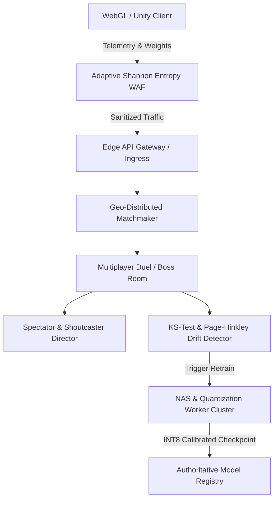

# NeuroArena: Advanced Machine Learning, Quantization & Spectator Director Specification

## 1. Executive Summary

This document specifies the technical architecture for the high-performance ML inference, automated Neural Architecture Search (NAS), edge model quantization, concept drift monitoring, geo-distributed matchmaking, and esports spectator orchestration engines in **NeuroArena**.

---

## 2. System Architecture Overview

---

## 3. Mathematical Foundations

### 3.1 Symmetric INT8 Quantization

Given a continuous 32-bit floating-point weight tensor $W \in \mathbb{R}^N$:

$$
\text{scale} = \frac{\max(|W|)}{127.0}, \quad q_i = \text{round}\left(\text{clamp}\left(\frac{W_i}{\text{scale}}, -128, 127\right)\right)
$$

Dequantization back to floating-point representation for forward inference:

$$
\hat{W}_i = q_i \times \text{scale}
$$

Error metrics are computed via Mean Squared Error (MSE) and Maximum Absolute Error (MAE):

$$
\text{MSE}(W, \hat{W}) = \frac{1}{N} \sum_{i=1}^N (W_i - \hat{W}_i)^2, \quad \text{MAE}(W, \hat{W}) = \max_{i} |W_i - \hat{W}_i|
$$

### 3.2 Pareto-Optimal Multi-Objective Neural Architecture Search

Candidate architectures $A \in \mathcal{A}$ are evaluated simultaneously across validation accuracy $\text{Acc}(A)$ and Multiply-Accumulate computation cost $\text{FLOPs}(A)$:

$$
\mathcal{S}_{\text{Pareto}}(A) = \alpha \cdot \text{Acc}(A) + (1 - \alpha) \cdot \left(1.0 - \frac{\text{FLOPs}(A)}{\text{FLOPs}_{\max}}\right)
$$

where default weight $\alpha = 0.70$.

### 3.3 Statistical Concept Drift Detection

#### 1. Page-Hinkley Cumulative Sum (CUSUM)
Given real-time telemetry stream $x_1, x_2, \dots, x_t$:

$$
\bar{x}_t = \frac{1}{t} \sum_{i=1}^t x_i, \quad U_t = \max(0, U_{t-1} + (x_t - \bar{x}_t - \delta)), \quad m_t = \min_{1 \le i \le t} U_i
$$

Drift is declared when:

$$
PH_t = U_t - m_t > \lambda
$$

#### 2. Two-Sample Kolmogorov-Smirnov Test
Tests the null hypothesis that empirical distributions $F_1(x)$ (baseline) and $F_2(x)$ (recent window) are drawn from the same underlying probability distribution:

$$
D_{n_1, n_2} = \sup_{x} |F_1(x) - F_2(x)|
$$

Rejection threshold at significance $\alpha = 0.01$:

$$
D_{crit} = 1.63 \times \sqrt{\frac{n_1 + n_2}{n_1 n_2}}
$$

---

## 4. Adaptive WAF & Shannon Entropy Defense

To defeat bot floods and payload replay tampering without allocating GC buffers:

$$
H(X) = -\sum_{i=1}^K p(x_i) \log_2 p(x_i)
$$

Payloads with $H(X) < 1.5$ (repetitive flood) or nonces present in the cryptographic sliding window filter are immediately dropped at the ingress layer.

---

## 5. Esports Spectator & Shoutcaster Director

The automated director analyzes:
1. **Critical Convergence**: Rapid loss velocity drop $\Delta \mathcal{L} > 0.15$ triggering close-up hyperparameter cinematic framing.
2. **Trajectory Split**: Sub-150 HP margin in endgame phases switching camera mode to split-view overview.
3. **Real-Time Win Probability**: Computed continuously via inverse loss and remaining character health.
