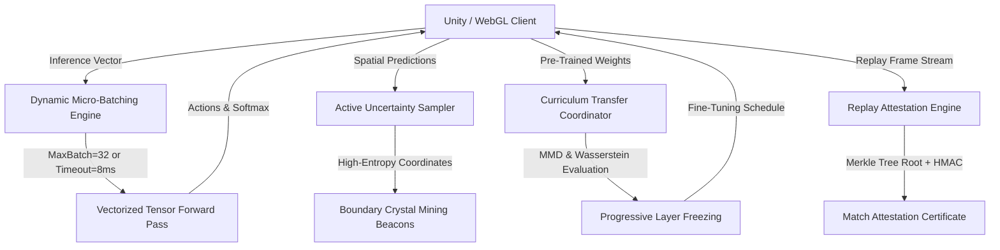

# NeuroArena: Curriculum Transfer Learning, Dynamic Batching & Replay Attestation Specification

## 1. Executive Summary

This specification outlines the technical architecture, mathematical foundations, and implementation guidelines for cross-biome curriculum transfer learning, adaptive SLA-driven inference micro-batching, active learning uncertainty sampling, and cryptographic replay attestation in **NeuroArena**.

---

## 2. System Architecture

---

## 3. Mathematical Foundations

### 3.1 Cross-Domain Discrepancy & Transferability

#### 1. 1-Wasserstein (Earth Mover's) Distance
Given source empirical distribution $P$ and target distribution $Q$ with cumulative distributions $F_P$ and $F_Q$:

$$
\mathcal{W}_1(P, Q) = \int_{-\infty}^{\infty} |F_P(x) - F_Q(x)| \, dx
$$

In empirical discrete sampling, given sorted samples $a_i \sim P$ and $b_i \sim Q$:

$$
\mathcal{W}_1(P, Q) \approx \frac{1}{N} \sum_{i=1}^{N} |a_i - b_i|
$$

#### 2. Maximum Mean Discrepancy (MMD)
With a Gaussian Radial Basis Function (RBF) kernel $k(x, x') = \exp(-\gamma \|x - x'\|^2)$:

$$
\text{MMD}^2(\mathcal{F}, P, Q) = \mathbb{E}_{x, x'}[k(x, x')] - 2 \mathbb{E}_{x, y}[k(x, y)] + \mathbb{E}_{y, y'}[k(y, y')]
$$

Transferability score $\mathcal{T}(P, Q)$ is formulated as:

$$
\mathcal{T}(P, Q) = \max\left(0.05, 1.0 - \left(0.5 \cdot \text{MMD} + 0.5 \cdot \min(1.0, \mathcal{W}_1)\right)\right)
$$

Negative transfer risk is flagged as `HIGH` when $\mathcal{T}(P, Q) < 0.35$.

### 3.2 Active Learning Uncertainty Sampling

Given model output probabilities $\mathbf{p} = [p_1, p_2, \dots, p_K]$ for $K$ classes:

1. **Normalized Shannon Entropy**:
$$
H(\mathbf{p}) = -\frac{1}{\ln(K)} \sum_{k=1}^K p_k \ln(p_k) \in [0, 1]
$$

2. **Margin Uncertainty**:
$$
M(\mathbf{p}) = 1.0 - \left(p_{\text{top1}} - p_{\text{top2}}\right) \in [0, 1]
$$

3. **Least Confidence Score**:
$$
LC(\mathbf{p}) = \frac{K}{K - 1} \left(1.0 - \max_k(p_k)\right) \in [0, 1]
$$

4. **Composite Active Exploration Index**:
$$
\mathcal{A}(\mathbf{p}) = 0.45 \cdot H(\mathbf{p}) + 0.35 \cdot M(\mathbf{p}) + 0.20 \cdot LC(\mathbf{p})
$$

### 3.3 Deterministic Replay Merkle Attestation

Each replay frame state $S_t$ at tick $t$ is serialized deterministically and hashed:

$$
h_t = \text{SHA256}\left(\text{canonical\_json}(S_t)\right)
$$

The overall match replay forms a Merkle tree with root hash $\mathcal{R}_{\text{replay}}$.
The authoritative server issues an HMAC-SHA256 signature using secret $K_{\text{cert}}$:

$$
\Sigma = \text{HMAC}_{\text{SHA256}}\left(K_{\text{cert}}, \, \text{MatchId} \,\|\, \text{PlayerId} \,\|\, N_{\text{frames}} \,\|\, \mathcal{R}_{\text{replay}}\right)
$$

---

## 4. Progressive Layer Freezing Policies

| Policy | Description | Early Layers (L1-L2) | Hidden Layers (L3) | Head (L4) |
|---|---|---|---|---|
| `None` | Full baseline training | Full LR | Full LR | Full LR |
| `FeatureExtractor` | Preserves representations | Frozen ($\text{LR}=0$) | Decayed ($\text{LR} \times 0.2$) | Full LR |
| `HeadOnly` | Rapid lightweight adaptation | Frozen ($\text{LR}=0$) | Frozen ($\text{LR}=0$) | Full LR |
| `ProgressiveUnfreeze` | Dynamic stage-wise unfreezing | Unfreeze on Plateau | Decayed | Full LR |

---

## 5. Dynamic Inference Batching SLA

- **Maximum Batch Size**: 32 concurrent agent queries
- **Maximum Wait Deadline**: 8 ms (flush unconditionally to uphold 60Hz tick budget)
- **Priority Bands**:
  - `HIGH`: Tournament and seasonal ranked matches
  - `NORMAL`: Casual and co-op matches
  - `LOW`: Ambient bot exploration and background simulation
