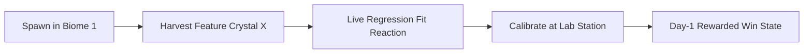

# FTUE Playable First-Session Tutorial Specification

## 1. Executive Summary
The First-Time User Experience (FTUE) in NeuroArena is strictly designed around active gameplay and direct experimentation (**Doing > Reading**). Players experience the complete core loop within the first 3 minutes of gameplay inside Biome 1 (**The Linear Steppes**).

---

## 2. Core Loop Architecture

### Steps & Timings
1. **Guided Harvest (<30s)**: In-world waypoint leading player to their first empirical Feature Crystal $(x)$.
2. **Live Regression Fit Reaction (<15s)**: Live floating HUD updates the regression line $\hat{y} = wx + b$ as soon as the sample is extracted.
3. **Mini-Challenge Calibration (<60s)**: Player approaches the Calibration Lab, initiates training, and achieves loss convergence $\text{MSE} \le 0.10$.
4. **Day-1 Mastery Reward (<10s)**: Instant grant of:
   - **Glacial Crystalline Terminal Skin**
   - **Vector Calibrator Starter Tool**
   - **Biome 2 (Binary Marshlands) Unlock**

---

## 3. Strict Rules & Constraints
- **$\le 1$ Sentence Instruction Limit**: No multi-sentence dialogs or blocking onboarding modals.
- **$>45$s In-World Idle Nudge**: Triggers spatial audio and mascot pointers if idle $>45$s.
- **Zero Auth Gating**: Guest mode reaches the first "aha" moment with zero forms. Account linking is strictly optional and post-tutorial.
- **Step-by-Step Funnel Telemetry**: Event pipeline tracking completion and drop-off per step via `ProductAnalyticsManager`.
