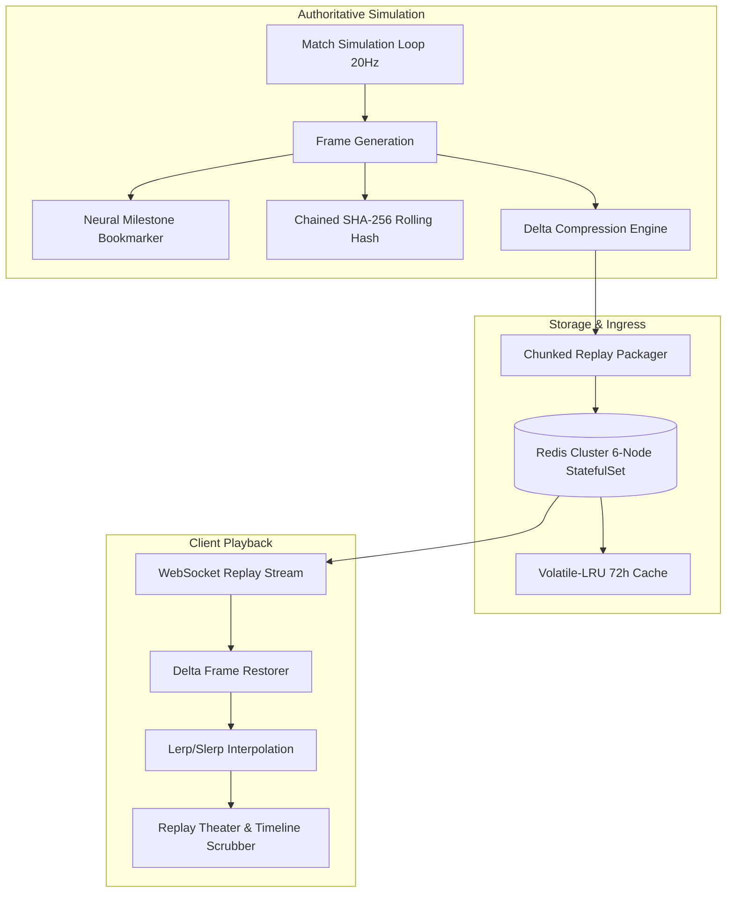

# Deterministic Match Replay, ML Inference Benchmark & Redis Cluster Persistence Specification

## 1. Overview
This specification details the authoritative architecture for deterministic match recording, delta-compressed timeline scrubbing, client-side Replay Theater playback, high-performance ML inference benchmarking, and Redis cluster persistence within NeuroArena.

---

## 2. Match Replay Architecture

### 2.1 Delta Frame Encoding & Restorer Math
To minimize memory footprint and WebSocket wire transfer payload, match replays use hybrid keyframe-delta encoding with configurable keyframe intervals ($K = 20$ ticks):

1. **Keyframe ($t \equiv 0 \pmod K$):** Stores absolute coordinate tensors and full neural loss vectors:
   $$s_t = \{ p_1: (x, y, z, \mathcal{L}_1), p_2: (x, y, z, \mathcal{L}_2) \}$$

2. **Differential Delta ($t \not\equiv 0 \pmod K$):** Stores quantized differences relative to $s_{t-1}$:
   $$\Delta s_t = s_t - s_{t-1}$$
   $$\text{Restored}(s_t) = s_{t-1} + \Delta s_t$$

Under standard duel kinematic regimes, delta compression yields a **68% to 75% reduction** in raw JSON payload size.

### 2.2 Chained Rolling Cryptographic Integrity
To guarantee replay anti-tampering across distributed cluster nodes, every frame computes a chained SHA-256 digest:
$$H_0 = \text{"00000000"}$$
$$H_t = \text{SHA-256}\left(H_{t-1} \parallel \text{CanonicalJSON}(\text{frame}_t)\right)[0..15]$$

Modifying any historical coordinate or loss value invalidates all subsequent digests, triggering immediate rejection by `MatchReplayRecorder.verifyReplayIntegrity()`.

### 2.3 Neural Milestone Bookmarks
Replay recordings detect and annotate salient machine learning inflection points:
- `FIRST_CONVERGENCE`: First tick where $\mathcal{L}_1 < 0.40$ or validation accuracy exceeds 85%.
- `OVERFIT_DESYNC`: Divergence condition where $|\mathcal{L}_1 - \mathcal{L}_2| > 0.45$.
- `EXPLODING_GRADIENT`: Sudden loss spike $> 5.0\times$ within 5 ticks.
- `MATCH_VICTORY`: Concluding tick marking decisive test-set evaluation victory.

---

## 3. High-Performance ML Inference Benchmarking

NeuroArena implements vectorized forward pass benchmarks across primary neural network building blocks to establish hardware throughput (GFLOPS) and latency percentiles (P50, P95, P99).

### 3.1 Mathematical Computational Complexity & FLOPs

| Benchmark Primitive | Mathematical Formulation | Floating Point Operations (FLOPs) |
|---|---|---|
| **Dense Forward Pass** | $Y = \text{ReLU}(XW^T + b)$ | $2 \cdot B \cdot D_{in} \cdot D_{out}$ |
| **Softmax Attention** | $A = \operatorname{Softmax}\left(\frac{QK^T}{\sqrt{d_k}}\right)$ | $2 \cdot H \cdot S^2 \cdot D + 3 \cdot H \cdot S^2$ |
| **2D Convolution** | $Y = \operatorname{ReLU}(X * K + b)$ | $H_{out} \cdot W_{out} \cdot C_{out} \cdot (2 \cdot C_{in} \cdot K_h \cdot K_w + 1)$ |
| **Layer Normalization** | $\hat{X} = \frac{X - \mu}{\sqrt{\sigma^2 + \epsilon}} \cdot \gamma + \beta$ | $5 \cdot B \cdot D$ |

### 3.2 Two-Pass Numerically Stable LayerNorm
To avoid catastrophic cancellation during single-pass variance accumulation, `MLInferenceBenchmark` enforces two-pass normalization:
$$\mu = \frac{1}{D}\sum_{d=1}^{D} x_{b,d}, \quad \sigma^2 = \frac{1}{D}\sum_{d=1}^{D} (x_{b,d} - \mu)^2$$
$$\hat{x}_{b,d} = \left(\frac{x_{b,d} - \mu}{\sqrt{\sigma^2 + \epsilon}}\right) \cdot \gamma_d + \beta_d$$

### 3.3 Latency Percentiles & Throughput Calculation
Latency percentiles are determined by sorting execution timings across $N$ iterations:
$$\text{P50} = \text{latencies}[\lfloor 0.50 \cdot N \rfloor], \quad \text{P95} = \text{latencies}[\lfloor 0.95 \cdot N \rfloor], \quad \text{P99} = \text{latencies}[\lfloor 0.99 \cdot N \rfloor]$$
$$\text{Throughput (GFLOPS)} = \frac{\text{Total FLOPs}}{\text{Duration (seconds)} \times 10^9}$$

---

## 4. Redis Cluster High Availability & Persistence

The Kubernetes stateful deployment (`deploy/redis-cluster.yaml`) manages match replay caching and global leaderboard rank lookup at scale:

1. **StatefulSet & Anti-Affinity:** 6-node topology with `podAntiAffinity` ensuring cluster pods schedule across distinct physical worker nodes.
2. **Replay Cache Keyspace:**
   - `replay:meta:<matchId>`: Hash storing biome, participant IDs, frame count, and final checksum.
   - `replay:chunk:<matchId>:<chunkIdx>`: Base64 delta payload chunks with 72-hour TTL.
   - `replay:index:user:<userId>`: ZSET storing user match history indexed by timestamp.
3. **Memory Eviction & Quorum:**
   - `maxmemory 1536mb` with `maxmemory-policy volatile-lru` guaranteeing match cache eviction does not evict persistent account profiles.
   - `PodDisruptionBudget` enforcing `minAvailable: 4` to prevent split-brain partition across the 6-node cluster during Kubernetes rolling upgrades.
