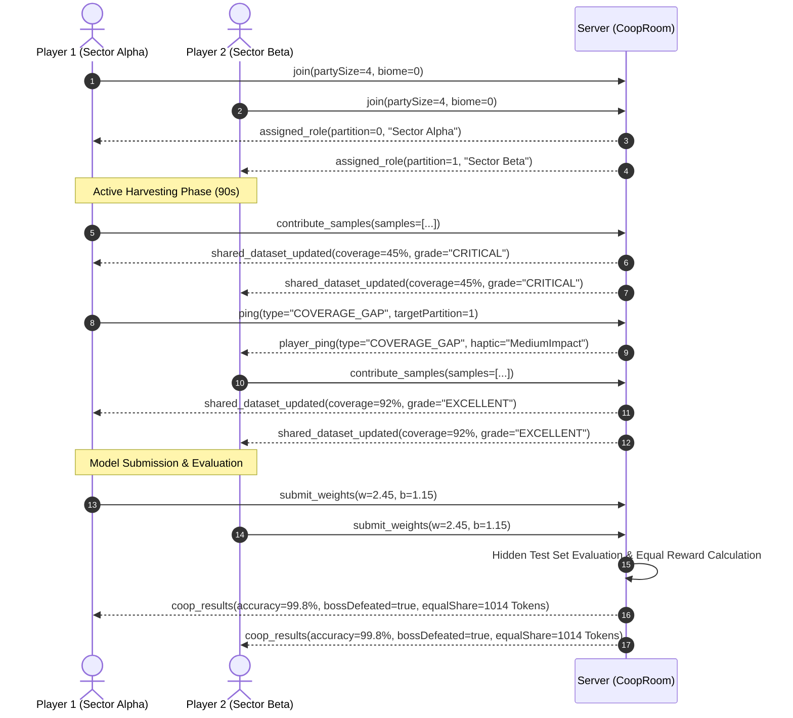

# NeuroArena Netcode & Binary Protocol Specification

## 1. Fast Binary Frame Packet Layout (`0x4e41` / 'NA')

| Offset (Bytes) | Type | Field | Description |
| :--- | :--- | :--- | :--- |
| 0..1 | `uint16` | Magic Header | `0x4e41` ('NA') |
| 2..5 | `uint32` | Tick | Monotonic simulation tick |
| 6..7 | `uint16` | Player ID | Integer player identifier |
| 8..11 | `float32` | Pos X | World position X |
| 12..15 | `float32` | Pos Y | World position Y |
| 16..19 | `float32` | Pos Z | World position Z |
| 20..23 | `float32` | Rot Y | Yaw angle in degrees |
| 24..27 | `float32` | Loss | Current training MSE loss |

**Total Size:** 28 bytes.

---

## 2. Adaptive Delta Packet Layout (`0x4e44` / 'ND')

| Offset | Type | Field | Description |
| :--- | :--- | :--- | :--- |
| 0..1 | `uint16` | Magic Header | `0x4e44` ('ND') |
| 2..5 | `uint32` | Tick | Monotonic simulation tick |
| 6..7 | `uint16` | Entity ID | Integer entity ID |
| 8 | `uint8` | Change Bitmask | Flags indicating modified fields |
| 9..* | `var` | Quantized Deltas | Fixed-point encoded delta fields |

### Bitmask Flags:
- `0x01`: `POS_X` (int16, 1mm resolution)
- `0x02`: `POS_Y` (int16, 1mm resolution)
- `0x04`: `POS_Z` (int16, 1mm resolution)
- `0x08`: `ROT_Y` (uint16, 0.0055° resolution)
- `0x10`: `LOSS` (int16, 0.0001 resolution)
- `0x20`: `VEL` (2x int16 velocity vectors)

---

## 3. 2-4 Player Collaborative Co-op Room (`CoopRoom`) Protocol Flow

